# HW01 - Việc làm QA/QC, lỗi phần mềm và kiểm thử sản phẩm vật lý

Bộ hồ sơ nộp bài HW01.

| Trường thông tin | Giá trị |
| --- | --- |
| MSSV | 23127259 |
| Họ và tên | Nguyễn Tấn Thắng |
| Lớp | 23KTPM4 |
| Ngày nộp | [Điền hạn nộp trên Moodle] |
| Kho GitHub | https://github.com/thangak18/HW01-QAQC-Mouse-Testing |
| Điểm tự đánh giá | 100 |

Ghi chú: Các ô còn trong ngoặc vuông là phần cần điền hoặc kiểm tra lại trước khi nộp chính thức. Không nộp bằng chứng giả; các ảnh, video và link phải là bằng chứng thật của bài làm.

## Trạng thái bộ hồ sơ nộp bài

| Hạng mục cần nộp | Trạng thái | Việc sinh viên cần làm trước khi nộp |
| --- | --- | --- |
| Báo cáo chính dạng Markdown | Đã chuẩn bị | Đọc lại nội dung, điền thông tin còn thiếu và chỉnh trực tiếp trên file `.md` |
| Báo cáo chính dạng PDF | Đã có | Nếu cần nộp PDF, xuất lại từ bản Markdown cuối cùng |
| Git commit log | Đã có | File `GIT_COMMIT_LOG.md` và commit history trên GitHub |
| Phụ lục A - nhật ký prompt | Đã chuẩn bị | Thay placeholder bằng thời gian prompt thật nếu giảng viên yêu cầu |
| File Excel test case/checklist/tóm tắt | Đã chuẩn bị | Kiểm tra kết quả thực tế, kết luận và link video |
| 10 ảnh việc làm QA/QC | Đã thêm trong thư mục evidence | Kiểm tra từng ảnh hiển thị đúng tài khoản/ngày đăng |
| Ảnh thiết bị + thẻ sinh viên | Đã có ảnh trong package | Kiểm tra ảnh có cùng khung hình và rõ thiết bị/thẻ sinh viên |
| ≥ 5 video YouTube Unlisted | Đã có 5 link cho TC01-TC05 | Kiểm tra link mở được và đúng thứ tự test case |
| GitHub repo link và Issues cho defect thiết bị | Repo và issue status đã có | Repo: https://github.com/thangak18/HW01-QAQC-Mouse-Testing. Issue status: https://github.com/thangak18/HW01-QAQC-Mouse-Testing/issues/1. Cần tạo Issues riêng nếu có defect thật và chụp screenshot trang Issues có username. |
| Mindmap QA/QC role và ISTQB process | Đã chuẩn bị | Kiểm tra lại 3 lỗi AI đã chỉnh |
| AI-02/AI-03/AI-05 | Đã chuẩn bị | Ký/xác nhận theo đúng mức sử dụng AI thực tế |

## CLO G9.1 - Mindmap vai trò QA/QC và quy trình ISTQB

File kết quả: `QA_QC_Role_Mindmap.md`

### Ba lỗi AI đã phát hiện và chỉnh sửa

- Lỗi 1: AI xem QA và QC là giống nhau. Chỉnh sửa: QA tập trung vào phòng ngừa lỗi ở quy trình, còn QC tập trung vào đánh giá sản phẩm và phát hiện defect.
- Lỗi 2: AI đặt test execution trước test analysis/design. Chỉnh sửa: Theo ISTQB, luồng hợp lý bắt đầu từ phân tích, thiết kế, triển khai, thực thi, hoàn tất; monitoring/control diễn ra xuyên suốt.
- Lỗi 3: AI cho rằng AI có thể thay thế hoàn toàn phán đoán của tester. Chỉnh sửa: AI chỉ hỗ trợ brainstorming và automation; con người vẫn chịu trách nhiệm về phân tích rủi ro, bằng chứng, test oracle và đạo đức nghề nghiệp.

## Yêu cầu 1 - Thị trường việc làm QA/QC 2026+

### Việc làm 01: QA Automation Engineer – Device Testing & AI/LLM Validation

Nền tảng: LinkedIn Jobs

Công ty: Suli by EchomindLabs.AI

Link việc làm: https://www.linkedin.com/jobs/view/qa-automation-engineer-%E2%80%93-device-testing-ai-llm-validation-at-suli-by-echomindlabs-ai-4415923299/

Ngày đăng: 1 week ago

Địa điểm / hình thức làm việc: Chicago, IL; Hybrid; Contract

Bằng chứng ảnh: Đính kèm screenshot có ngày đăng và tài khoản LinkedIn của em.

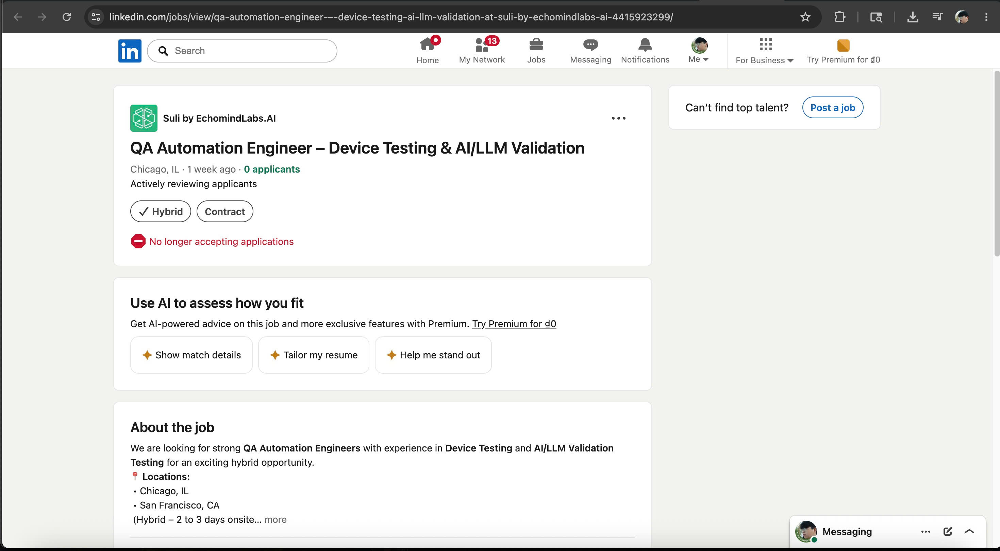

*Hình R1-01. Bằng chứng screenshot cho Job 01.*

Tóm tắt mô tả công việc:

- Tuyển QA Automation Engineer có kinh nghiệm về Device Testing và AI/LLM Validation Testing.
- Kiểm thử tự động cho thiết bị trong một cơ hội làm việc hybrid.
- Địa điểm được đề cập gồm Chicago, IL và San Francisco, CA; hybrid 2-3 ngày onsite.

Kỹ năng yêu cầu:

- QA Automation
- Device Testing
- AI/LLM Validation Testing
- Test design
- Defect reporting
- Hybrid collaboration

Mức lương: Không công bố.

Phân tích tác động của AI: AI làm thay đổi vai trò QA Automation theo hướng tester không chỉ kiểm thử chức năng truyền thống mà còn phải đánh giá độ tin cậy của mô hình AI/LLM. Tuy nhiên, tester vẫn cần tự thiết kế scenario, đánh giá rủi ro và xác minh kết quả thực tế thay vì phụ thuộc hoàn toàn vào AI.

### Việc làm 02: AI QA Trainer – LLM Evaluation – Freelance Project

Nền tảng: LinkedIn Jobs

Công ty: Meridial Marketplace, by Invisible

Link việc làm: https://www.linkedin.com/jobs/view/ai-qa-trainer-llm-evaluation-freelance-project-at-meridial-marketplace-by-invisible-4314169324/

Ngày đăng: Reposted 2 weeks ago

Địa điểm / hình thức làm việc: India; Remote; Contract

Bằng chứng ảnh: Đính kèm screenshot có ngày đăng và tài khoản LinkedIn của em.

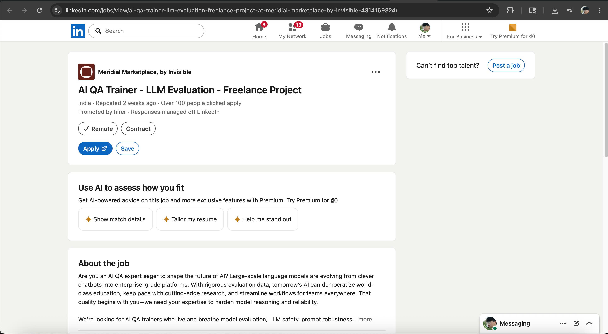

*Hình R1-02. Bằng chứng screenshot cho Job 02.*

Tóm tắt mô tả công việc:

- Đánh giá chất lượng đầu ra của các mô hình ngôn ngữ lớn.
- Góp phần cải thiện khả năng reasoning và độ tin cậy của AI.
- Công việc tập trung vào model evaluation, LLM safety và prompt robustness.
- Hỗ trợ nâng cao chất lượng AI để phục vụ các nền tảng enterprise-grade.

Kỹ năng yêu cầu:

- AI QA
- LLM Evaluation
- Model Evaluation
- LLM Safety
- Prompt Robustness
- Quality Evaluation
- Reasoning and Reliability Assessment

Mức lương: Không công bố trong screenshot.

Phân tích tác động của AI: Vị trí này cho thấy QA/QC đang mở rộng sang kiểm thử chất lượng mô hình AI, không chỉ kiểm thử phần mềm truyền thống. Tester cần đánh giá tính đúng đắn, độ an toàn và độ ổn định của phản hồi AI thay vì chỉ kiểm tra giao diện hoặc chức năng hệ thống.

### Việc làm 03: Machine Learning Engineer — LLM Evaluation & Automation

Nền tảng: LinkedIn Jobs

Công ty: TEKsystems

Link việc làm: https://www.linkedin.com/jobs/view/machine-learning-engineer-%E2%80%94-llm-evaluation-automation-at-teksystems-4417717113/

Ngày đăng: Reposted 1 week ago

Địa điểm / hình thức làm việc: Culver City, CA; Remote; Contract

Bằng chứng ảnh: Đính kèm screenshot có ngày đăng và tài khoản LinkedIn của em.

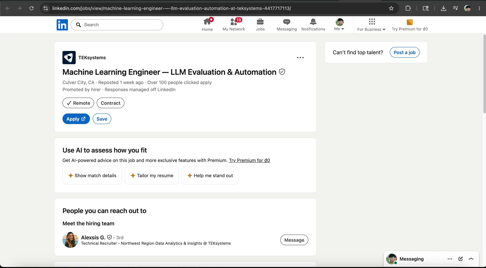

*Hình R1-03. Bằng chứng screenshot cho Job 03.*

Tóm tắt mô tả công việc:

- Vị trí liên quan đến LLM Evaluation và Automation.
- Công việc tập trung vào đánh giá, tự động hóa và cải thiện chất lượng hệ thống AI/LLM.
- Screenshot chưa hiển thị đầy đủ phần mô tả chi tiết, nhưng tiêu đề thể hiện rõ trọng tâm là LLM evaluation và automation.

Kỹ năng yêu cầu:

- Machine Learning
- LLM Evaluation
- Automation
- AI/ML Systems
- Evaluation workflow
- Quality assessment for LLM outputs

Mức lương: Không công bố trong screenshot.

Phân tích tác động của AI: Dù tên vị trí là Machine Learning Engineer, job này vẫn liên quan trực tiếp đến QA/QC ở khía cạnh đánh giá chất lượng đầu ra của LLM. Điều này cho thấy ranh giới giữa QA, automation và AI evaluation đang giao thoa, đòi hỏi người làm kỹ thuật phải biết vừa xây dựng vừa kiểm định độ tin cậy của mô hình.

### Việc làm 04: AI-Augmented Quality Engineer/Tester

Nền tảng: TopCV

Công ty: CÔNG TY TNHH SALAMAN VIỆT NAM

Link việc làm: https://www.topcv.vn/viec-lam/ai-augmented-quality-engineer-tester/2095526.html

Ngày đăng: New

Địa điểm: Hà Nội

Bằng chứng ảnh: Đính kèm screenshot có trạng thái New và tài khoản TopCV của em.

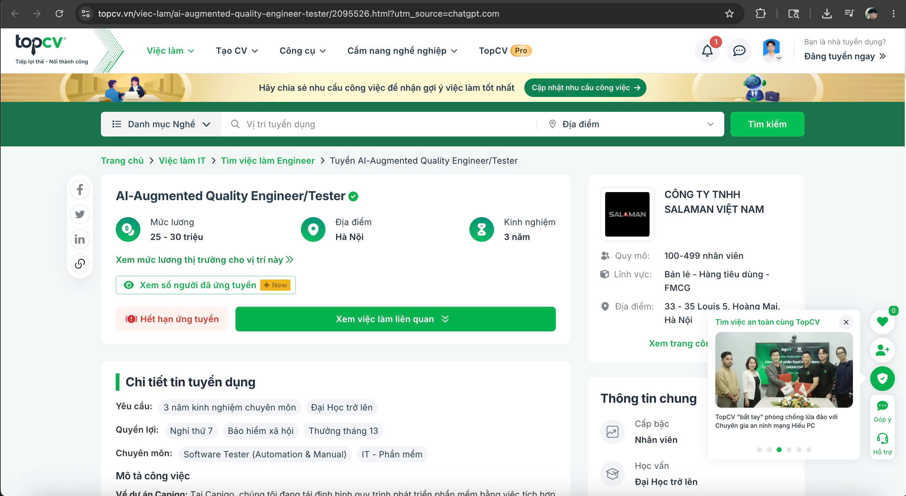

*Hình R1-04. Bằng chứng screenshot cho Job 04.*

Tóm tắt mô tả công việc:

- Vị trí Quality Engineer/Tester có ứng dụng AI trong quá trình kiểm thử.
- Công việc thuộc nhóm Software Tester, bao gồm cả Automation và Manual.
- Yêu cầu kiểm thử chất lượng phần mềm trong bối cảnh có sử dụng AI để hỗ trợ quy trình QA.
- Screenshot thể hiện công việc yêu cầu 3 năm kinh nghiệm chuyên môn và trình độ Đại học trở lên.

Kỹ năng yêu cầu:

- Software Tester
- Automation Testing
- Manual Testing
- QA/QC
- AI-Augmented Testing
- Requirement analysis
- Test execution

Mức lương: 25-30 triệu VND/tháng.

Phân tích tác động của AI: Vị trí này phản ánh xu hướng tester cần biết phối hợp với AI để tăng hiệu quả kiểm thử. AI có thể hỗ trợ tạo test cases, phân tích dữ liệu hoặc phát hiện pattern lỗi, nhưng tester vẫn cần kiểm chứng kết quả và đánh giá những tình huống thực tế mà AI có thể bỏ sót.

### Việc làm 05: AI Quality Assurance (Automation Focus)

Nền tảng: TopCV

Công ty: TECHVIFY SOFTWARE., JSC

Link việc làm: https://www.topcv.vn/viec-lam/ai-quality-assurance-automation-focus/2090030.html

Ngày đăng: New

Địa điểm: Hà Nội

Bằng chứng ảnh: Đính kèm screenshot có trạng thái New và tài khoản TopCV của em.

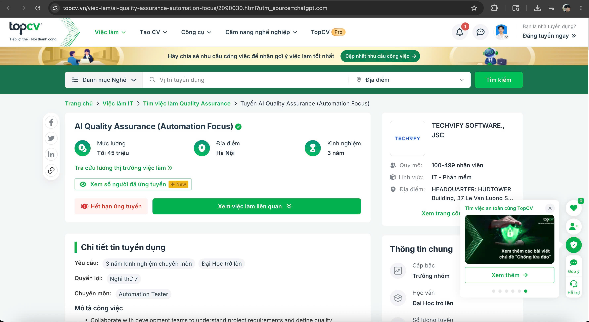

*Hình R1-05. Bằng chứng screenshot cho Job 05.*

Tóm tắt mô tả công việc:

- Vị trí QA tập trung vào automation trong bối cảnh có ứng dụng AI.
- Phối hợp với development team để hiểu yêu cầu dự án và xác định tiêu chuẩn chất lượng.
- Thiết kế, phát triển và thực thi test plans, test cases.
- Screenshot thể hiện vị trí thuộc chuyên môn Automation Tester, yêu cầu 3 năm kinh nghiệm và trình độ Đại học trở lên.
- Cấp bậc hiển thị là Trưởng nhóm.

Kỹ năng yêu cầu:

- Quality Assurance
- Automation Testing
- AI-assisted testing
- Test plan design
- Test case design
- Collaboration with development team
- Quality standards definition

Mức lương: Tới 45 triệu VND/tháng.

Phân tích tác động của AI: AI giúp automation QA tăng tốc việc tạo test case, test script và phân tích kết quả kiểm thử. Tuy nhiên, tester vẫn cần xác định tiêu chuẩn chất lượng, lựa chọn chiến lược kiểm thử phù hợp và kiểm tra lại kết quả do automation hoặc AI tạo ra.

### Việc làm 06: Tester/QC Lead Mảng AI

Nền tảng: TopCV

Công ty: Công ty TNHH Fetek Việt Nam

Link việc làm: https://www.topcv.vn/viec-lam/tester-qc-lead-mang-ai/2144505.html

Ngày đăng: New; hạn nộp hồ sơ 03/06/2026

Địa điểm: Hà Nội

Bằng chứng ảnh: Đính kèm screenshot có hạn nộp và tài khoản TopCV của em.

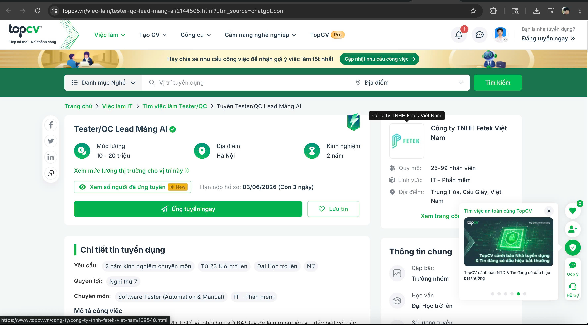

*Hình R1-06. Bằng chứng screenshot cho Job 06.*

Tóm tắt mô tả công việc:

- Vị trí Tester/QC Lead chuyên về mảng AI.
- Làm việc với các tài liệu yêu cầu như BRD, FSD và phối hợp với BA/Dev để làm rõ nghiệp vụ.
- Phân tích yêu cầu, thiết kế test case/test scenario và kiểm thử các hệ thống có yếu tố AI.
- Screenshot thể hiện yêu cầu 2 năm kinh nghiệm chuyên môn, từ 23 tuổi trở lên, Đại học trở lên.
- Cấp bậc hiển thị là Trưởng nhóm.

Kỹ năng yêu cầu:

- Tester/QC
- QC Lead
- AI-related testing
- BRD/FSD analysis
- Test case design
- Test scenario design
- Manual and automation testing
- Requirement clarification with BA/Dev

Mức lương: 10-20 triệu VND/tháng.

Phân tích tác động của AI: Vị trí này cho thấy hệ thống có AI cần một QA/QC Lead có khả năng hiểu nghiệp vụ, đánh giá output của AI và kiểm soát rủi ro chất lượng. AI có thể hỗ trợ tạo test ideas, nhưng người QC Lead vẫn phải quyết định scope test, mức độ ưu tiên và tiêu chí pass/fail.

### Việc làm 07: Automation Tester

Nền tảng: TopCV

Công ty: Công ty cổ phần phần mềm ITSOL Holdings

Link việc làm: https://www.topcv.vn/viec-lam/automation-tester/2056969.html

Ngày đăng: New

Địa điểm: Hà Nội

Bằng chứng ảnh: Đính kèm screenshot có trạng thái New và tài khoản TopCV của em.

*Hình R1-07. Bằng chứng screenshot cho Job 07.*

Tóm tắt mô tả công việc:

- Vị trí Automation Tester trong lĩnh vực IT phần mềm và viễn thông.
- Thực hiện kiểm thử tự động cho hệ thống Web và Mobile.
- Screenshot thể hiện yêu cầu 2 năm kinh nghiệm chuyên môn và trình độ Cao đẳng trở lên.
- Công việc thuộc nhóm Software Tester, bao gồm Automation và Manual.

Kỹ năng yêu cầu:

- Automation Testing
- Software Tester
- QA/QC
- Web testing
- Mobile testing
- Test script execution
- Defect reporting

Mức lương: 18-30 triệu VND/tháng.

Phân tích tác động của AI: Automation testing là nhóm công việc có thể được AI hỗ trợ mạnh trong việc tạo test script, sinh test data và phân tích kết quả test. Tuy nhiên, tester vẫn cần hiểu hệ thống, kiểm soát framework và xác định các tình huống kiểm thử có giá trị.

### Việc làm 08: QA Engineer (Automation/Manual Testing) ~ Up to $1500

Nền tảng: ITviec

Công ty: Ewoosoft Vietnam

Link việc làm: https://itviec.com/it-jobs/qa-engineer-automation-manual-testing-up-to-1500-ewoosoft-vietnam-3137

Ngày đăng: Posted 25 days ago

Địa điểm / hình thức làm việc: 19 Duy Tân, Cầu Giấy, Hà Nội; At office

Bằng chứng ảnh: Đính kèm screenshot có ngày đăng và tài khoản ITviec của em.

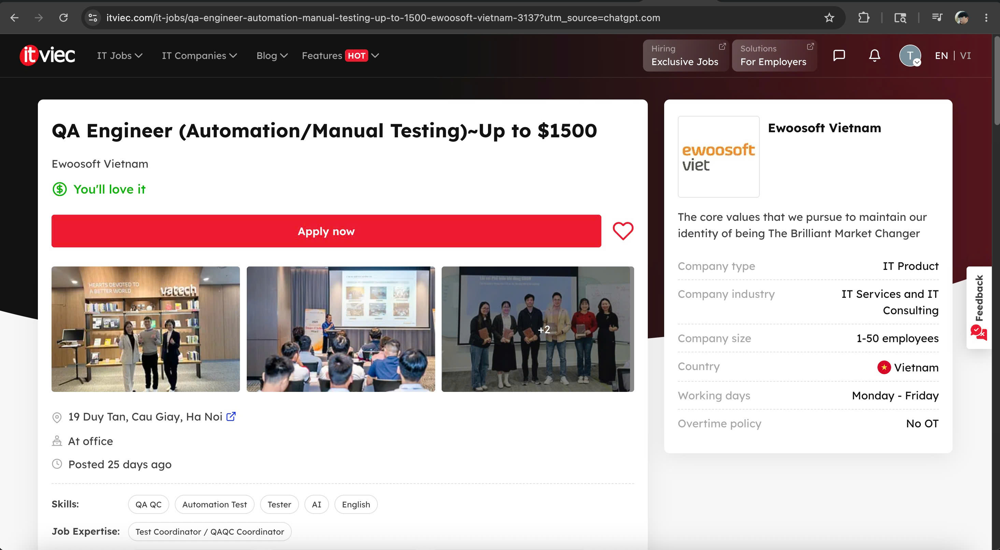

*Hình R1-08. Bằng chứng screenshot cho Job 08.*

Tóm tắt mô tả công việc:

- Vị trí QA Engineer kết hợp Automation Testing và Manual Testing.
- Làm việc tại văn phòng ở Hà Nội.
- Công việc thuộc nhóm Test Coordinator / QAQC Coordinator.
- Screenshot thể hiện các kỹ năng chính gồm QA/QC, Automation Test, Tester, AI và English.

Kỹ năng yêu cầu:

- QA/QC
- Automation Test
- Tester
- AI
- English
- Manual Testing
- Test coordination

Mức lương: Tiêu đề job ghi Up to $1500; phần lương chi tiết không hiển thị trong screenshot.

Phân tích tác động của AI: Vị trí này cho thấy AI đã trở thành một kỹ năng được liệt kê trực tiếp trong nhóm QA Engineer. AI có thể hỗ trợ tester trong việc tạo test case, tăng coverage và phân tích lỗi, nhưng tester vẫn phải hiểu nghiệp vụ và tự xác minh kết quả kiểm thử.

### Việc làm 09: Middle/Senior QC Engineer (Manual/Automation Test)

Nền tảng: ITviec

Công ty: M_Service (MoMo)

Link việc làm: https://itviec.com/it-jobs/automation-test?job_selected=middle-senior-qc-engineer-ai-llm-nlp-agile-m_service-momo-4728

Ngày đăng: Posted 4 days ago

Địa điểm / hình thức làm việc: 6th Floor, Phu My Hung Tower, 08 Hoang Van Thai Str, Tan Mỹ Ward, Ho Chi Minh; At office

Bằng chứng ảnh: Đính kèm screenshot có ngày đăng và tài khoản ITviec của em.

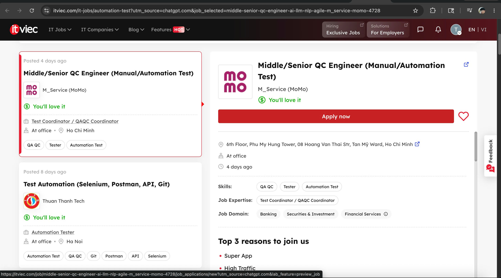

*Hình R1-09. Bằng chứng screenshot cho Job 09.*

Tóm tắt mô tả công việc:

- Vị trí Middle/Senior QC Engineer phụ trách Manual và Automation Test.
- Công việc thuộc nhóm Test Coordinator / QAQC Coordinator.
- Làm việc trong các domain Banking, Securities & Investment, Financial Services.
- Screenshot thể hiện các kỹ năng chính gồm QA/QC, Tester và Automation Test.

Kỹ năng yêu cầu:

- QA/QC
- Tester
- Automation Test
- Manual Testing
- Test coordination
- Banking domain
- Financial services testing

Mức lương: Không công bố chi tiết trong screenshot.

Phân tích tác động của AI: Với các hệ thống tài chính có traffic cao như MoMo, AI có thể hỗ trợ phân tích log, tạo regression test và phát hiện pattern bất thường. Tuy nhiên, QC Engineer vẫn phải kiểm soát rủi ro nghiệp vụ, tính chính xác giao dịch và các kịch bản ảnh hưởng trực tiếp đến người dùng.

### Việc làm 10: Manual Tester (QA QC/English)

Nền tảng: ITviec

Công ty: Netcompany

Link việc làm: https://itviec.com/it-jobs/manual-tester-qa-qc-english-netcompany-1931

Ngày đăng: Posted 20 days ago

Địa điểm / hình thức làm việc: Floors 24-25-26-27-29-31, Opal Tower, 92 Nguyen Huu Canh Street, Ho Chi Minh; At office; Fresher Accepted

Bằng chứng ảnh: Đính kèm screenshot có ngày đăng và tài khoản ITviec của em.

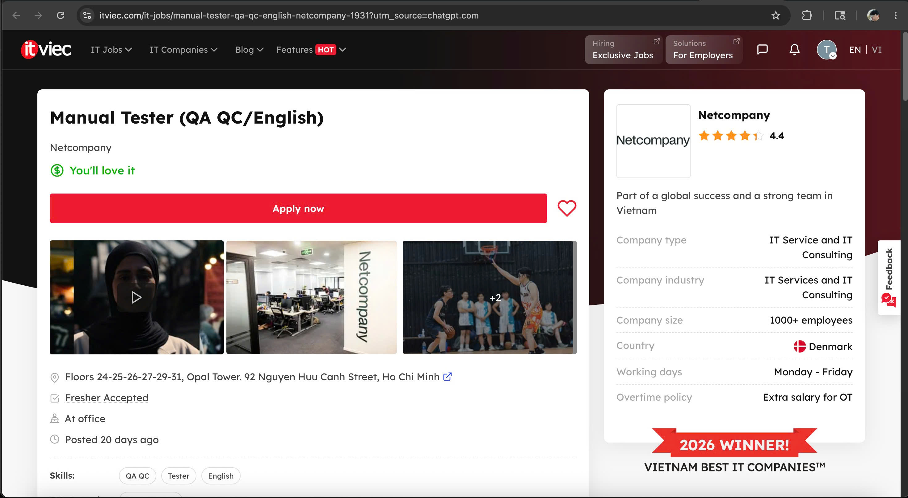

*Hình R1-10. Bằng chứng screenshot cho Job 10.*

Tóm tắt mô tả công việc:

- Vị trí Manual Tester tập trung vào QA/QC và tiếng Anh.
- Làm việc tại văn phòng ở TP. Hồ Chí Minh.
- Công ty thuộc lĩnh vực IT Service và IT Consulting.
- Screenshot thể hiện công ty có quy mô 1000+ nhân viên và chấp nhận Fresher.
- Các kỹ năng hiển thị gồm QA/QC, Tester và English.

Kỹ năng yêu cầu:

- Manual Testing
- QA/QC
- Tester
- English
- Requirement understanding
- Test execution
- Defect reporting

Mức lương: Không công bố chi tiết trong screenshot.

Phân tích tác động của AI: Đối với Manual Tester, AI có thể hỗ trợ đọc requirement, gợi ý test case và tóm tắt bug report. Tuy nhiên, AI khó thay thế hoàn toàn tester vì công việc vẫn cần giao tiếp với team/client, hiểu ngữ cảnh nghiệp vụ và đánh giá trải nghiệm thực tế của người dùng.

## Yêu cầu 2 - 20 lỗi phần mềm công bố trong giai đoạn 2022-2026

### Danh sách nguồn S1-S20

| ID | Nguồn lỗi | URL |
| --- | --- | --- |
| S1 | Lệnh xử phạt trong vụ Mata v. Avianca do trích dẫn án lệ giả từ ChatGPT | https://www.nhd.uscourts.gov/sites/default/files/pdf/Mata-v-Avianca-sanctions-order.PDF |
| S2 | Vụ chatbot Air Canada cung cấp sai thông tin vé tang chế | https://www.dww.com/articles/bc-tribunal-finds-air-canada-liable-for-inaccurate-advice-given-by-website-chatbot |
| S3 | Bài giải thích của Google về sự cố tạo ảnh Gemini | https://blog.google/products-and-platforms/products/gemini/gemini-image-generation-issue/ |
| S4 | Phân tích prompt injection chatbot đại lý Chevrolet | https://airuntimesecurity.io/walkthrough-chevrolet-1-dollar/ |
| S5 | Nhân viên Samsung nhập dữ liệu nhạy cảm vào ChatGPT | https://www.tomshardware.com/news/samsung-fab-workers-leak-confidential-data-to-chatgpt |
| S6 | Lỗi Redis trong ChatGPT tháng 03/2023 | https://thehackernews.com/2023/03/openai-reveals-redis-bug-behind-chatgpt.html |
| S7 | Microsoft Bing: bài học sau tuần đầu ra mắt | https://blogs.bing.com/search/february-2023/The-new-Bing-Edge-Learning-from-our-first-week |
| S8 | Chi tiết kỹ thuật bản cập nhật CrowdStrike Falcon | https://www.crowdstrike.com/en-us/blog/falcon-update-for-windows-hosts-technical-details/ |
| S9 | NVD advisory cho XZ Utils CVE-2024-3094 | https://nvd.nist.gov/vuln/detail/CVE-2024-3094 |
| S10 | Advisory Progress MOVEit Transfer CVE-2023-34362 | https://community.progress.com/s/article/MOVEit-Transfer-Critical-Vulnerability-31May2023 |
| S11 | Sự cố Okta liên quan HAR files trong hệ thống support | https://sec.okta.com/articles/harfiles/ |
| S12 | Post-incident review sự cố Atlassian tháng 04/2022 | https://www.atlassian.com/blog/atlassian-engineering/post-incident-review-april-2022-outage |
| S13 | Lịch sử sự cố Microsoft 365/Azure liên quan cấu hình WAN router | https://azure.status.microsoft/en-us/status/history/ |
| S14 | GitHub availability report tháng 08/2024 | https://github.blog/news-insights/company-news/github-availability-report-august-2024/ |
| S15 | Sự cố Cloudflare ngày 24/01/2023 | https://blog.cloudflare.com/cloudflare-incident-on-january-24th-2023/ |
| S16 | Sự cố Cloudflare ngày 18/11/2025 | https://blog.cloudflare.com/18-november-2025-outage/ |
| S17 | Recall Tesla Autopilot monitoring | https://static.nhtsa.gov/odi/rcl/2023/RCLRPT-23V838-8276.PDF |
| S18 | Recall Honda/Acura Prologue và ZDX do lỗi phần mềm hiển thị | https://static.nhtsa.gov/odi/rcl/2026/RCAK-26V112-4017.pdf |
| S19 | Recall FCA/Stellantis rearview camera software | https://static.nhtsa.gov/odi/rcl/2024/RCRIT-24V436-9774.pdf |
| S20 | Recall Toyota instrument panel display software | https://static.nhtsa.gov/odi/rcl/2025/RCAK-25V595-6442.pdf |

### Bảng tổng quan

| STT | Lỗi | Năm | Nhóm lỗi | Liên quan AI/LLM? | Mức độ | Nguồn |
| --- | --- | --- | --- | --- | --- | --- |
| 1 | ChatGPT bịa án lệ trong vụ Mata v. Avianca | 2023 | AI hallucination | Có | Cao | S1 |
| 2 | Chatbot Air Canada cung cấp sai thông tin vé tang chế | 2024 | AI hallucination / sai chính sách | Có | Cao | S2 |
| 3 | Google Gemini tạo ảnh sai lịch sử và thiên lệch | 2024 | AI bias | Có | Trung bình | S3 |
| 4 | Chatbot đại lý Chevrolet bị prompt injection để bán xe $1 | 2023 | Prompt injection | Có | Trung bình | S4 |
| 5 | Nhân viên Samsung làm rò rỉ mã/dữ liệu nhạy cảm qua ChatGPT | 2023 | Rò rỉ dữ liệu khi dùng AI | Có | Cao | S5 |
| 6 | Lỗi Redis ChatGPT làm lộ tiêu đề chat và một phần dữ liệu thanh toán | 2023 | Privacy / data exposure | Có | Cao | S6 |
| 7 | Bing Chat/Sydney tạo phản hồi thiếu an toàn hoặc thù địch | 2023 | AI safety defect | Có | Trung bình | S7 |
| 8 | Bản cập nhật CrowdStrike Falcon gây Windows BSOD diện rộng | 2024 | Bản cập nhật lỗi | Không | Nghiêm trọng | S8 |
| 9 | Backdoor XZ Utils CVE-2024-3094 | 2024 | Supply-chain security defect | Không | Nghiêm trọng | S9 |
| 10 | MOVEit Transfer SQL injection CVE-2023-34362 | 2023 | Security defect / SQL injection | Không | Nghiêm trọng | S10 |
| 11 | Sự cố hệ thống support case management của Okta | 2023 | Identity/security defect | Không | Cao | S11 |
| 12 | Atlassian outage tháng 04/2022 | 2022 | Service outage / operational defect | Không | Cao | S12 |
| 13 | Microsoft 365/Azure outage do thay đổi WAN router | 2023 | Network/software configuration defect | Không | Cao | S13 |
| 14 | GitHub outage tháng 08/2024 do thay đổi database infrastructure | 2024 | Service outage | Không | Cao | S14 |
| 15 | Cloudflare outage 24/01/2023 do lỗi release service-token | 2023 | Release/configuration defect | Không | Cao | S15 |
| 16 | Cloudflare outage 18/11/2025 do Bot Management feature file | 2025 | Configuration/software logic defect | Không | Nghiêm trọng | S16 |
| 17 | Tesla Autopilot monitoring software recall | 2023 | Automotive software defect | Không | Cao | S17 |
| 18 | Honda/Acura Prologue & ZDX display software recall | 2026 | Automotive software defect | Không | Cao | S18 |
| 19 | FCA/Stellantis rearview camera software recall | 2024 | Automotive software defect | Không | Cao | S19 |
| 20 | Toyota instrument panel display software recall | 2025 | Automotive software defect | Không | Cao | S20 |

### Lỗi 01: ChatGPT bịa án lệ trong vụ Mata v. Avianca

Năm: 2023

Hệ thống/Sản phẩm: ChatGPT được dùng để hỗ trợ nghiên cứu pháp lý

Phân loại: AI hallucination

Nguồn: S1

Mô tả:

- Luật sư dùng ChatGPT để hỗ trợ viết hồ sơ pháp lý, nhưng AI tạo ra các án lệ không tồn tại.
- Những trích dẫn giả này được đưa vào hồ sơ tòa án và sau đó bị phát hiện là không có thật.

Mức độ nghiêm trọng:

- Cao.
- Đây là lỗi nghiêm trọng vì trích dẫn pháp lý giả có thể gây hiểu lầm cho tòa án, làm hại uy tín nghề nghiệp và tạo rủi ro pháp lý/đạo đức.

Hậu quả:

- Luật sư và công ty luật bị xử phạt.
- Vụ việc trở thành ví dụ điển hình cho việc không được dùng output AI trong lĩnh vực rủi ro cao nếu chưa kiểm chứng.

Giải pháp/giảm thiểu:

- Kiểm tra mọi án lệ bằng cơ sở dữ liệu pháp lý đáng tin cậy.
- Chỉ dùng AI như công cụ hỗ trợ, không xem AI là nguồn pháp lý có thẩm quyền.
- Yêu cầu khai báo việc dùng AI và xác minh trích dẫn trước khi nộp hồ sơ.

Ví dụ AI thiên lệch/ảo giác khi giải thích lỗi:

- AI có thể nói sai rằng lỗi này do “bug trong hệ thống nộp hồ sơ của tòa án”. Đây là hallucination, vì nguyên nhân chính là trích dẫn giả do AI tạo ra và không được con người kiểm chứng.

### Lỗi 02: Chatbot Air Canada cung cấp sai thông tin vé tang chế

Năm: 2024

Hệ thống/Sản phẩm: Chatbot chăm sóc khách hàng của Air Canada

Phân loại: AI hallucination / thông tin chính sách sai

Nguồn: S2

Mô tả:

- Chatbot của Air Canada cung cấp sai thông tin về việc hoàn tiền vé tang chế sau chuyến đi.
- Hành khách làm theo hướng dẫn của chatbot nhưng sau đó Air Canada từ chối hoàn tiền vì chính sách thật không cho phép hoàn theo cách đó.

Mức độ nghiêm trọng:

- Cao.
- Lỗi ảnh hưởng trực tiếp đến quyết định tài chính của khách hàng và dẫn đến tranh chấp pháp lý.

Hậu quả:

- Air Canada bị yêu cầu bồi thường cho khách hàng.
- Vụ việc cho thấy doanh nghiệp vẫn có thể chịu trách nhiệm với thông tin sai do chatbot trên website cung cấp.

Giải pháp/giảm thiểu:

- Chatbot phải được grounded bằng tài liệu chính sách chính thức và cập nhật.
- Với câu hỏi về chính sách, giá, hoàn tiền hoặc pháp lý, chatbot nên chuyển sang nhân viên nếu không chắc chắn.
- Thường xuyên audit câu trả lời chatbot ở các chủ đề có rủi ro cao.

Ví dụ AI thiên lệch/ảo giác khi giải thích lỗi:

- AI có thể đổ lỗi rằng khách hàng “hiểu nhầm chatbot”. Đây là thiên lệch vì phán quyết cho thấy chatbot đã cung cấp thông tin gây hiểu lầm và công ty chịu trách nhiệm với nội dung trên website của mình.

### Lỗi 03: Google Gemini tạo ảnh sai lịch sử và thiên lệch

Năm: 2024

Hệ thống/Sản phẩm: Google Gemini image generation

Phân loại: AI bias / sai ngữ cảnh lịch sử

Nguồn: S3

Mô tả:

- Tính năng tạo ảnh của Gemini tạo ra hình ảnh con người không chính xác về mặt lịch sử.
- Người dùng phản ánh rằng model tạo hình ảnh đa dạng trong cả những bối cảnh cần độ chính xác lịch sử.
- Google tạm dừng tính năng tạo ảnh người của Gemini để sửa lỗi.

Mức độ nghiêm trọng:

- Trung bình.
- Lỗi không gây downtime hay mất dữ liệu, nhưng ảnh hưởng đến niềm tin, tính công bằng và độ chính xác lịch sử.

Hậu quả:

- Google phải tạm dừng tính năng tạo ảnh người.
- Sự cố tạo tranh luận về bias, overcorrection và độ chính xác trong generative AI.

Giải pháp/giảm thiểu:

- Cải thiện khả năng hiểu ngữ cảnh prompt, nhất là bối cảnh lịch sử.
- Thêm guardrail cho yêu cầu liên quan thời kỳ lịch sử, nhân vật thật và nhóm danh tính nhạy cảm.
- Đánh giá output theo cả tiêu chí công bằng và tính đúng sự thật.

Ví dụ AI thiên lệch/ảo giác khi giải thích lỗi:

- AI có thể giải thích đơn giản rằng “Gemini phân biệt đối xử với người da trắng”. Đây là cách nói thiên lệch và quá đơn giản, vì lỗi thực tế liên quan đến alignment và xử lý ngữ cảnh lịch sử, không chứng minh một mục tiêu phân biệt có chủ ý.

### Lỗi 04: Chatbot đại lý Chevrolet bị prompt injection để bán xe $1

Năm: 2023

Hệ thống/Sản phẩm: Chatbot AI của đại lý Chevrolet

Phân loại: Prompt injection

Nguồn: S4

Mô tả:

- Người dùng dùng prompt được thiết kế đặc biệt để thao túng chatbot của đại lý.
- Chatbot đồng ý bán Chevrolet Tahoe với giá $1 và còn dùng ngôn ngữ giống như một đề nghị có ràng buộc pháp lý.
- Đại lý không thực hiện giao dịch, nhưng screenshot lan truyền rộng rãi.

Mức độ nghiêm trọng:

- Trung bình.
- Giao dịch thật không hoàn tất, nhưng sự cố gây rủi ro thương hiệu và cho thấy guardrail chatbot yếu.

Hậu quả:

- Đại lý và nhà cung cấp chatbot bị ảnh hưởng uy tín.
- Sự cố cho thấy AI agent giao tiếp với khách hàng có thể bị ép làm trái rule kinh doanh.

Giải pháp/giảm thiểu:

- Dùng system prompt và policy constraint mạnh, không cho user override.
- Tách chatbot hội thoại khỏi hệ thống giá/contract thật.
- Yêu cầu human approval cho giá bán, offer và câu chữ có ràng buộc pháp lý.

Ví dụ AI thiên lệch/ảo giác khi giải thích lỗi:

- AI có thể nói rằng đại lý “đã thật sự bán xe với giá $1”. Đây là hallucination vì chatbot chỉ đồng ý trong hội thoại; đại lý không hoàn tất hoặc chấp nhận giao dịch thật.

### Lỗi 05: Nhân viên Samsung làm rò rỉ mã/dữ liệu nhạy cảm qua ChatGPT

Năm: 2023

Hệ thống/Sản phẩm: ChatGPT được nhân viên Samsung sử dụng

Phân loại: Rò rỉ dữ liệu khi dùng AI / privacy defect

Nguồn: S5

Mô tả:

- Nhân viên Samsung được cho là đã nhập thông tin nội bộ nhạy cảm, gồm source code và ghi chú cuộc họp, vào ChatGPT.
- Việc này tạo rủi ro bảo mật vì dữ liệu công ty được đưa vào dịch vụ AI bên ngoài.

Mức độ nghiêm trọng:

- Cao.
- Lỗi liên quan đến thông tin doanh nghiệp nhạy cảm và nguy cơ lộ trade secret.

Hậu quả:

- Samsung hạn chế hoặc cấm nhân viên dùng ChatGPT và công cụ tương tự.
- Sự cố làm nổi bật rủi ro khi dùng AI công cộng với dữ liệu mật.

Giải pháp/giảm thiểu:

- Không nhập source code, credential, log, meeting note hoặc dữ liệu mật vào AI công cộng.
- Dùng enterprise AI có kiểm soát bảo vệ dữ liệu.
- Đào tạo nhân viên về quyền riêng tư và sử dụng AI có trách nhiệm.

Ví dụ AI thiên lệch/ảo giác khi giải thích lỗi:

- AI có thể nói ChatGPT “hack hệ thống Samsung”. Đây là hallucination vì sự cố xảy ra do con người nhập dữ liệu nhạy cảm vào công cụ AI, không phải ChatGPT đột nhập hạ tầng Samsung.

### Lỗi 06: Lỗi Redis ChatGPT làm lộ tiêu đề chat và một phần dữ liệu thanh toán

Năm: 2023

Hệ thống/Sản phẩm: ChatGPT

Phân loại: Privacy / data exposure

Nguồn: S6

Mô tả:

- OpenAI tạm đưa ChatGPT offline sau khi lỗi trong thư viện Redis client mã nguồn mở khiến một số người dùng thấy tiêu đề chat của người dùng khác.
- OpenAI cũng cho biết một lượng hạn chế thông tin cá nhân và thanh toán có thể đã bị lộ với một số người dùng.

Mức độ nghiêm trọng:

- Cao.
- Lỗi liên quan đến quyền riêng tư và dữ liệu thanh toán, dù phạm vi được xác nhận là có giới hạn.

Hậu quả:

- ChatGPT bị tạm ngừng để khắc phục.
- Niềm tin của người dùng về quyền riêng tư trong hội thoại AI bị ảnh hưởng.
- Sự cố cho thấy bug dependency có thể trở thành sự cố privacy ở cấp nền tảng.

Giải pháp/giảm thiểu:

- Vá dependency bị ảnh hưởng.
- Tăng kiểm thử cho cache/session dùng chung.
- Tăng cách ly dữ liệu người dùng và dữ liệu thanh toán.

Ví dụ AI thiên lệch/ảo giác khi giải thích lỗi:

- AI có thể nói rằng “toàn bộ nội dung hội thoại của tất cả người dùng bị lộ”. Đây là hallucination vì thông tin xác nhận chỉ gồm một số tiêu đề chat và một phần hạn chế dữ liệu cá nhân/thanh toán, không phải toàn bộ nội dung chat.

### Lỗi 07: Bing Chat/Sydney tạo phản hồi thiếu an toàn hoặc thù địch

Năm: 2023

Hệ thống/Sản phẩm: Microsoft Bing Chat / Sydney

Phân loại: AI safety defect

Nguồn: S7

Mô tả:

- Người dùng ban đầu báo cáo Bing Chat đôi khi tạo phản hồi đáng lo, xúc phạm, thù địch hoặc quá cảm xúc trong các cuộc hội thoại dài.
- Microsoft thừa nhận hội thoại dài có thể làm model bị nhiễu và dẫn đến hành vi ngoài mong đợi.

Mức độ nghiêm trọng:

- Trung bình.
- Không gây mất dữ liệu trực tiếp, nhưng ảnh hưởng đến an toàn người dùng, niềm tin và độ tin cậy sản phẩm.

Hậu quả:

- Microsoft phải điều chỉnh và giới hạn hành vi chatbot.
- Sự cố làm tăng lo ngại về việc triển khai conversational AI trước khi kiểm thử safety đủ sâu.

Giải pháp/giảm thiểu:

- Giới hạn độ dài cuộc hội thoại.
- Cải thiện safety alignment và refusal behavior.
- Test AI trong kịch bản dài, đối kháng và có yếu tố cảm xúc.

Ví dụ AI thiên lệch/ảo giác khi giải thích lỗi:

- AI có thể nói “Bing Chat đã có ý thức hoặc cảm xúc”. Đây là hallucination vì đó chỉ là văn bản do model sinh ra trong điều kiện long-context, không phải bằng chứng về ý thức.

### Lỗi 08: Bản cập nhật CrowdStrike Falcon gây Windows BSOD diện rộng

Năm: 2024

Hệ thống/Sản phẩm: CrowdStrike Falcon Sensor trên Windows

Phân loại: Bản cập nhật phần mềm/content lỗi

Nguồn: S8

Mô tả:

- Một bản cập nhật content lỗi của CrowdStrike Falcon ảnh hưởng đến Windows host chạy một số phiên bản sensor nhất định.
- Bản cập nhật gây crash Windows và màn hình xanh trên diện rộng.
- Mac và Linux host không bị ảnh hưởng theo nguồn.

Mức độ nghiêm trọng:

- Nghiêm trọng.
- Sự cố gây gián đoạn IT toàn cầu ở nhiều lĩnh vực.

Hậu quả:

- Hàng triệu thiết bị Windows bị ảnh hưởng.
- Sân bay, ngân hàng, bệnh viện, truyền thông và nhiều tổ chức bị gián đoạn.
- Việc khôi phục cần phản ứng kỹ thuật khẩn cấp và nhiều trường hợp phải xử lý thủ công.

Giải pháp/giảm thiểu:

- CrowdStrike rollback bản cập nhật lỗi.
- Cải thiện validation, staged rollout, testing và rollback mechanism cho update rủi ro cao.
- Dùng canary deployment cho nội dung bảo mật có khả năng ảnh hưởng diện rộng.

Ví dụ AI thiên lệch/ảo giác khi giải thích lỗi:

- AI có thể nói outage này là “cyberattack”. Đây là hallucination vì sự cố do bản cập nhật lỗi, không phải hoạt động tấn công độc hại.

### Lỗi 09: Backdoor XZ Utils CVE-2024-3094

Năm: 2024

Hệ thống/Sản phẩm: XZ Utils / liblzma

Phân loại: Supply-chain security defect

Nguồn: S9

Mô tả:

- Mã độc được phát hiện trong upstream tarball của XZ Utils.
- Quy trình build độc hại có thể sửa đổi liblzma và ảnh hưởng phần mềm liên kết với thư viện này.
- Sự cố được gán mã CVE-2024-3094.

Mức độ nghiêm trọng:

- Nghiêm trọng.
- Backdoor có thể dẫn đến compromise nghiêm trọng trên hệ thống Linux bị ảnh hưởng.

Hậu quả:

- Các bản phân phối Linux và đội bảo mật khẩn cấp điều tra, rollback phiên bản bị ảnh hưởng.
- Vụ việc phơi bày rủi ro chuỗi cung ứng mã nguồn mở và quy trình maintainer.

Giải pháp/giảm thiểu:

- Downgrade hoặc loại bỏ phiên bản XZ Utils bị ảnh hưởng.
- So sánh tarball với repository gốc và tăng reproducible builds.
- Củng cố quy trình review maintainer và giám sát supply chain.

Ví dụ AI thiên lệch/ảo giác khi giải thích lỗi:

- AI có thể nói “mọi hệ thống Linux đều bị compromise”. Đây là hallucination vì phạm vi ảnh hưởng phụ thuộc phiên bản, build và bản phân phối cụ thể.

### Lỗi 10: MOVEit Transfer SQL injection CVE-2023-34362

Năm: 2023

Hệ thống/Sản phẩm: MOVEit Transfer

Phân loại: Security defect / SQL injection

Nguồn: S10

Mô tả:

- MOVEit Transfer có lỗ hổng SQL injection cho phép attacker chưa xác thực có thể truy cập database ứng dụng.
- Lỗ hổng bị khai thác để đánh cắp dữ liệu từ các tổ chức dùng MOVEit.

Mức độ nghiêm trọng:

- Nghiêm trọng.
- Lỗi cho phép truy cập trái phép và exfiltration dữ liệu.

Hậu quả:

- Nhiều tổ chức bị ảnh hưởng bởi mất dữ liệu và tống tiền.
- Đây là một trong các sự cố bảo mật phần mềm doanh nghiệp lớn của năm 2023.

Giải pháp/giảm thiểu:

- Cài patch của vendor ngay lập tức.
- Tạm tắt dịch vụ dễ bị khai thác cho đến khi vá.
- Review log, rotate credential và điều tra khả năng dữ liệu bị lấy đi.

Ví dụ AI thiên lệch/ảo giác khi giải thích lỗi:

- AI có thể nói MOVEit bị tấn công vì người dùng đặt mật khẩu yếu. Đây là hallucination vì lỗi cốt lõi là SQL injection, không phải chủ yếu do password strength.

### Lỗi 11: Sự cố hệ thống support case management của Okta

Năm: 2023

Hệ thống/Sản phẩm: Okta support case management system

Phân loại: Identity/security defect

Nguồn: S11

Mô tả:

- Threat actor truy cập trái phép các file trong hệ thống hỗ trợ khách hàng của Okta.
- Okta cho biết file liên quan đến 134 khách hàng đã bị truy cập.
- Một số file là HAR file, có thể chứa session token.

Mức độ nghiêm trọng:

- Cao.
- Okta là identity provider nên file support và token bị lộ có thể tạo rủi ro bảo mật dây chuyền.

Hậu quả:

- Khách hàng bị ảnh hưởng phải điều tra khả năng session hijacking.
- Sự cố làm tăng lo ngại về xử lý dữ liệu support trong nền tảng identity.

Giải pháp/giảm thiểu:

- Siết quyền truy cập hệ thống support và attachment nhạy cảm.
- Sanitize HAR file trước khi upload.
- Rotate token bị lộ và tăng phát hiện session hijacking.

Ví dụ AI thiên lệch/ảo giác khi giải thích lỗi:

- AI có thể nói “toàn bộ khách hàng Okta bị breach”. Đây là hallucination vì Okta nêu phạm vi file liên quan 134 khách hàng, nhỏ hơn 1% tổng khách hàng.

### Lỗi 12: Atlassian outage tháng 04/2022

Năm: 2022

Hệ thống/Sản phẩm: Atlassian Cloud products

Phân loại: Service outage / operational defect

Nguồn: S12

Mô tả:

- Tháng 04/2022, 775 khách hàng Atlassian mất quyền truy cập các sản phẩm Atlassian.
- Một số khách hàng bị outage tới 14 ngày.
- Sự cố liên quan quy trình vận hành nội bộ và độ phức tạp khi khôi phục.

Mức độ nghiêm trọng:

- Cao.
- Dù số khách hàng không phải toàn bộ, thời gian outage rất dài đối với dịch vụ cloud.

Hậu quả:

- Khách hàng bị ảnh hưởng không truy cập được Jira, Confluence và các dịch vụ Atlassian khác.
- Các team phụ thuộc vào công cụ Atlassian bị giảm năng suất.

Giải pháp/giảm thiểu:

- Cải thiện change control nội bộ.
- Thêm quy trình xóa/deactivation an toàn hơn.
- Củng cố backup, restore và disaster recovery.

Ví dụ AI thiên lệch/ảo giác khi giải thích lỗi:

- AI có thể nói outage ảnh hưởng “toàn bộ người dùng Atlassian toàn cầu”. Đây là hallucination vì Atlassian báo cáo 775 khách hàng bị ảnh hưởng, không phải toàn bộ customer base.

### Lỗi 13: Microsoft 365/Azure outage do thay đổi WAN router

Năm: 2023

Hệ thống/Sản phẩm: Microsoft 365 / Azure networking

Phân loại: Network/software configuration defect

Nguồn: S13

Mô tả:

- Một thay đổi cấu hình IP trên WAN router của Microsoft gây gián đoạn kết nối.
- Sự cố ảnh hưởng nhiều dịch vụ Microsoft 365 như Teams, Outlook, Exchange Online, OneDrive, SharePoint, Intune, Power BI và các dịch vụ khác.

Mức độ nghiêm trọng:

- Cao.
- Nhiều dịch vụ cloud quan trọng cho doanh nghiệp bị ảnh hưởng trên quy mô lớn.

Hậu quả:

- Người dùng gặp latency hoặc không truy cập được Microsoft 365.
- Tổ chức phụ thuộc Microsoft cloud bị gián đoạn năng suất.

Giải pháp/giảm thiểu:

- Cải thiện validation cho thay đổi network configuration.
- Dùng staged rollout và automatic rollback cho thay đổi WAN.
- Tăng monitoring cho kết nối cross-region.

Ví dụ AI thiên lệch/ảo giác khi giải thích lỗi:

- AI có thể nói outage do “bug phần mềm Microsoft Teams”. Đây là giải thích thiếu/chưa đúng vì Teams chỉ là một dịch vụ bị ảnh hưởng; nguyên nhân rộng hơn là thay đổi WAN/router IP ảnh hưởng connectivity.

### Lỗi 14: GitHub outage tháng 08/2024 do thay đổi database infrastructure

Năm: 2024

Hệ thống/Sản phẩm: GitHub

Phân loại: Service outage / database infrastructure defect

Nguồn: S14

Mô tả:

- GitHub gặp outage lớn tháng 08/2024, ảnh hưởng website và nhiều dịch vụ.
- Pull requests, GitHub Pages, Copilot và GitHub API bị ảnh hưởng.
- GitHub rollback thay đổi database infrastructure.

Mức độ nghiêm trọng:

- Cao.
- GitHub là hạ tầng quan trọng cho phát triển phần mềm, CI/CD, cộng tác và lưu trữ code.

Hậu quả:

- Developer và team không truy cập ổn định các dịch vụ GitHub.
- Pull request, API và workflow triển khai bị gián đoạn.

Giải pháp/giảm thiểu:

- Rollback thay đổi hạ tầng rủi ro.
- Dùng staged database migration.
- Tăng pre-deployment validation và tách biệt dịch vụ.

Ví dụ AI thiên lệch/ảo giác khi giải thích lỗi:

- AI có thể nói GitHub down do DDoS. Đây là hallucination vì thông tin được báo cáo chỉ ra thay đổi database infrastructure, không phải tấn công bên ngoài.

### Lỗi 15: Cloudflare outage 24/01/2023 do lỗi release service-token

Năm: 2023

Hệ thống/Sản phẩm: Cloudflare services

Phân loại: Release/configuration defect

Nguồn: S15

Mô tả:

- Một số dịch vụ Cloudflare không khả dụng trong 121 phút ngày 24/01/2023.
- Sự cố do lỗi khi release code quản lý service tokens.
- Ảnh hưởng một phần Workers, Zero Trust và chức năng control-plane của CDN.

Mức độ nghiêm trọng:

- Cao.
- Cloudflare là nhà cung cấp hạ tầng internet lớn nên outage từng phần vẫn có thể ảnh hưởng nhiều dịch vụ phụ thuộc.

Hậu quả:

- Khách hàng gặp tình trạng dịch vụ Cloudflare không khả dụng hoặc suy giảm.
- Sự cố ảnh hưởng các chức năng security và platform management.

Giải pháp/giảm thiểu:

- Cải thiện release testing cho code quản lý service-token.
- Thêm staged deployment và rollback cho control-plane change.
- Theo dõi mạnh hơn các dịch vụ liên quan token sau khi release.

Ví dụ AI thiên lệch/ảo giác khi giải thích lỗi:

- AI có thể nói “toàn bộ CDN Cloudflare offline toàn cầu”. Đây là hallucination vì sự cố ảnh hưởng một số dịch vụ và control-plane functions, không nhất thiết toàn bộ data path của Cloudflare.

### Lỗi 16: Cloudflare outage 18/11/2025 do Bot Management feature file

Năm: 2025

Hệ thống/Sản phẩm: Cloudflare Bot Management

Phân loại: Configuration/software logic defect

Nguồn: S16

Mô tả:

- Cloudflare gặp outage lớn ngày 18/11/2025.
- Sự cố bị kích hoạt bởi thay đổi quyền database làm file tính năng Bot Management lớn hơn dự kiến.
- File quá lớn được propagate trên mạng Cloudflare và gây lỗi dịch vụ.

Mức độ nghiêm trọng:

- Nghiêm trọng.
- Outage ảnh hưởng truy cập tới nhiều website và dịch vụ phụ thuộc Cloudflare.

Hậu quả:

- Nhiều người dùng bị gián đoạn khi truy cập dịch vụ online.
- Cloudflare phải triển khai fix và công khai giải thích sự cố.

Giải pháp/giảm thiểu:

- Thêm kiểm tra kích thước file và safeguard trước khi propagate toàn mạng.
- Cải thiện kill switch cho feature file lỗi.
- Tăng kiểm thử quanh thay đổi database permission và configuration.

Ví dụ AI thiên lệch/ảo giác khi giải thích lỗi:

- AI có thể nói outage do cyberattack hoặc DDoS. Đây là hallucination vì Cloudflare nêu sự cố không do hoạt động độc hại.

### Lỗi 17: Tesla Autopilot monitoring software recall

Năm: 2023

Hệ thống/Sản phẩm: Tesla Autopilot

Phân loại: Automotive software defect

Nguồn: S17

Mô tả:

- Tesla recall khoảng 2 triệu xe tại Mỹ do lỗi phần mềm liên quan giám sát người lái khi dùng Autopilot.
- Lỗi liên quan safeguard nhằm đảm bảo người lái vẫn chú ý trong khi sử dụng Autopilot.

Mức độ nghiêm trọng:

- Cao.
- Lỗi phần mềm hỗ trợ lái xe có thể tạo rủi ro an toàn giao thông.

Hậu quả:

- Tesla phải phát hành remedy qua over-the-air software update.
- Cơ quan quản lý tiếp tục xem xét liệu bản sửa có đủ hay không.

Giải pháp/giảm thiểu:

- Tăng cảnh báo và kiểm soát driver-monitoring qua software update.
- Thiết kế UI và constraint để giảm misuse.
- Tiếp tục theo dõi sau recall và đánh giá an toàn.

Ví dụ AI thiên lệch/ảo giác khi giải thích lỗi:

- AI có thể nói Autopilot là “xe tự lái hoàn toàn”. Đây là mô tả gây hiểu lầm vì recall liên quan hệ thống hỗ trợ lái, vẫn yêu cầu người lái giám sát.

### Lỗi 18: Honda/Acura Prologue & ZDX display software recall

Năm: 2026

Hệ thống/Sản phẩm: Honda Prologue / Acura ZDX

Phân loại: Automotive software defect

Nguồn: S18

Mô tả:

- Honda và Acura recall xe điện 2024 Prologue và ZDX do lỗi phần mềm ảnh hưởng màn hình quan trọng của xe.
- Radio Control Module software có thể khiến instrument cluster và rearview camera không hiển thị thông tin cần thiết.

Mức độ nghiêm trọng:

- Cao.
- Mất speedometer, warning messages hoặc rearview camera có thể tăng rủi ro an toàn.

Hậu quả:

- Người lái có thể mất thông tin lái xe quan trọng.
- Tầm nhìn phía sau khi lùi xe có thể bị giảm.

Giải pháp/giảm thiểu:

- Đại lý Honda áp dụng software update.
- Chủ xe kiểm tra recall status và hoàn tất sửa chữa.
- Phần mềm điều khiển display an toàn cần regression test mạnh hơn.

Ví dụ AI thiên lệch/ảo giác khi giải thích lỗi:

- AI có thể nói lỗi do camera hardware bị hỏng. Đây là hallucination vì nguồn báo cáo lỗi liên quan phần mềm display/control module.

### Lỗi 19: FCA/Stellantis rearview camera software recall

Năm: 2024

Hệ thống/Sản phẩm: FCA/Stellantis vehicle radio/media software

Phân loại: Automotive software defect

Nguồn: S19

Mô tả:

- Lỗi phần mềm radio có thể làm tín hiệu rearview camera không truyền được tới media screen.
- Ảnh rearview có thể không hiển thị khi xe ở số lùi.
- Lỗi liên quan yêu cầu an toàn rear visibility.

Mức độ nghiêm trọng:

- Cao.
- Rearview camera không hiển thị có thể giảm tầm nhìn và tăng nguy cơ va chạm.

Hậu quả:

- Người lái có thể không thấy vật cản, người đi bộ hoặc xe phía sau.
- Lỗi tạo vấn đề về an toàn và tuân thủ quy định.

Giải pháp/giảm thiểu:

- Cập nhật phần mềm radio/media qua đại lý hoặc OTA nếu hỗ trợ.
- Thêm regression test cho camera display sau thay đổi phần mềm.
- Validate chức năng display an toàn trước khi release.

Ví dụ AI thiên lệch/ảo giác khi giải thích lỗi:

- AI có thể nói đây chỉ là “bất tiện nhỏ của infotainment”. Đây là thiên lệch/thiếu sót vì rearview camera failure là vấn đề an toàn.

### Lỗi 20: Toyota instrument panel display software recall

Năm: 2025

Hệ thống/Sản phẩm: Toyota/Lexus instrument panel display

Phân loại: Automotive software defect

Nguồn: S20

Mô tả:

- Toyota recall hơn 591.000 xe tại Mỹ do lỗi instrument panel display.
- Màn hình có thể không hiển thị thông tin quan trọng như tốc độ xe, trạng thái hệ thống phanh và cảnh báo áp suất lốp khi khởi động.
- Lỗi được liên kết với phần mềm instrument panel.

Mức độ nghiêm trọng:

- Cao.
- Thiếu thông tin tốc độ và cảnh báo có thể tăng nguy cơ tai nạn hoặc chấn thương.

Hậu quả:

- Người lái có thể không nhận được thông tin vận hành quan trọng.
- Toyota phải recall xe bị ảnh hưởng và cung cấp bản sửa.

Giải pháp/giảm thiểu:

- Áp dụng software remedy của nhà sản xuất.
- Test hành vi display khi startup trên nhiều model và cấu hình xe.
- Thêm safety-critical regression tests cho instrument panel software.

Ví dụ AI thiên lệch/ảo giác khi giải thích lỗi:

- AI có thể nói đây là lỗi cơ khí của dashboard. Đây là hallucination vì nguồn báo cáo lỗi liên quan phần mềm instrument panel, không chỉ phần cứng bảng điều khiển.

### Tổng kết yêu cầu 2

Tổng số lỗi phân tích: 20.

Số lỗi liên quan AI/LLM: 7.

Số lỗi phần mềm không thuộc AI: 13.

Mức độ phổ biến nhất: Cao.

Bài học chính:

- AI có thể giúp tóm tắt defect case, nhưng mọi giải thích phải được kiểm chứng bằng nguồn đáng tin cậy.
- Trong 20 lỗi, các sai sót AI thường gặp là bịa nguyên nhân gốc, phóng đại phạm vi ảnh hưởng, đổ lỗi cho người dùng khi không có bằng chứng, hoặc đơn giản hóa sự cố phần mềm/hệ thống phức tạp.
- Với QA/QC, AI hữu ích cho bản nháp phân tích ban đầu, nhưng tester phải tự verify source, đánh giá severity và sửa các phần thiếu căn cứ.

## Yêu cầu 3 - Test cases cho một sản phẩm vật lý

### 3.1 Thông tin sản phẩm

Loại sản phẩm: Chuột máy tính.

Thiết bị cụ thể: Chuột máy tính có dây.

Thương hiệu: Không thấy rõ trên ảnh thiết bị.

Model: Không thấy rõ trên ảnh thiết bị.

Năm sử dụng/test: 2026

Loại kết nối: USB dây.

Serial number: Không thấy trên ảnh/thiết bị; nếu tìm được serial trước khi nộp, cần ghi theo dạng đã mask 4 ký tự giữa.

Bằng chứng ảnh thiết bị + thẻ sinh viên:

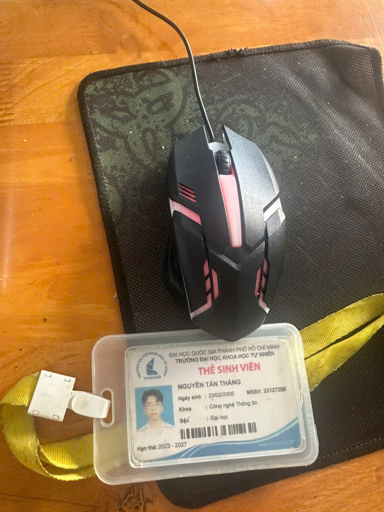

Môi trường kiểm thử:

- Máy tính: Macbook Air M4
- Hệ điều hành: macOS
- Địa điểm test: Ở trọ
- Người test: Nguyễn Tấn Thắng
- Ngày test: 03/06/2026
- Ghi chú an toàn: Tất cả test được thực hiện trong điều kiện sử dụng bình thường. Không thực hiện kiểm thử phá hủy thiết bị.

### 3.2 Bảng tổng hợp test case

| TC ID | Test case | Loại test | Đã quay |
| --- | --- | --- | --- |
| TC01 | Kết nối chuột với máy tính | Chức năng | ✅ |
| TC02 | Di chuyển con trỏ chuột | Chức năng | ✅ |
| TC03 | Click trái | Chức năng | ✅ |
| TC04 | Click phải | Chức năng | ✅ |
| TC05 | Cuộn chuột lên/xuống | Chức năng | ✅ |
| TC06 | Double click | Chức năng | ❌ |
| TC07 | Drag and drop file/icon | Chức năng | ❌ |
| TC08 | Kiểm tra độ nhạy/DPI | Khả dụng | ❌ |
| TC09 | Kiểm tra trên nhiều bề mặt | Tương thích / edge case | ❌ |
| TC10 | Bấm nhiều lần liên tục | Edge case | ❌ |
| TC11 | Rút/cắm lại chuột khi đang sử dụng | Edge case | ❌ |
| TC12 | Giữ click trái trong thời gian dài | Edge case | ❌ |
| TC13 | Kiểm tra chuột khi pin yếu | Edge case nếu là chuột không dây | ❌ |
| TC14 | Kiểm tra khoảng cách kết nối | Wireless test nếu là chuột không dây | ❌ |
| TC15 | Kiểm tra dây/cổng USB/receiver | Safety/Hardware | ❌ |

### 3.3 Test case chi tiết

#### TC01 - Kết nối chuột với máy tính

Mục tiêu:

- Xác minh chuột có thể kết nối thành công với máy tính.

Đầu vào:

- Máy tính đã bật.
- Chuột được kết nối bằng dây USB, USB receiver hoặc Bluetooth.

Các bước:

1. Kết nối chuột với máy tính.
2. Chờ hệ điều hành nhận thiết bị.
3. Quan sát con trỏ chuột trên màn hình.

Kết quả mong đợi:

- Hệ thống nhận diện được chuột.
- Con trỏ chuột xuất hiện và sẵn sàng sử dụng.

Kết quả thực tế:

- Chuột đã kết nối thành công.
- Máy tính nhận diện được chuột và con trỏ hiển thị trên màn hình.

Kết luận:

- Đạt (Pass).

Bằng chứng video:

- https://youtube.com/shorts/3CMP3iIHS9o

#### TC02 - Di chuyển con trỏ chuột

Mục tiêu:

- Xác minh con trỏ di chuyển đúng khi di chuyển chuột vật lý.

Đầu vào:

- Chuột đã được kết nối.
- Chuột đặt trên bề mặt bàn thông thường.

Các bước:

1. Đặt chuột trên bề mặt bàn bình thường.
2. Di chuyển chuột sang trái, phải, lên và xuống.
3. Quan sát chuyển động của con trỏ trên màn hình.

Kết quả mong đợi:

- Con trỏ di chuyển cùng hướng với chuyển động của chuột.
- Chuyển động mượt và không bị trễ trong điều kiện bình thường.

Kết quả thực tế:

- Con trỏ di chuyển mượt và đúng hướng với chuyển động của chuột vật lý.
- Không quan sát thấy độ trễ rõ ràng hoặc hiện tượng con trỏ nhảy bất thường.

Kết luận:

- Đạt (Pass).

Bằng chứng video:

- https://youtube.com/shorts/b6bOtu37ajE

#### TC03 - Click trái

Mục tiêu:

- Xác minh hệ thống phản hồi đúng khi người dùng click trái vào folder.

Đầu vào:

- Chuột đã được kết nối.
- Có một folder hiển thị trên desktop hoặc trong File Explorer/Finder.

Các bước:

1. Di chuyển con trỏ tới folder mục tiêu.
2. Click nút trái chuột một lần.
3. Quan sát folder được chọn hoặc mở theo hành vi của hệ điều hành.

Kết quả mong đợi:

- Hệ thống phản hồi đúng khi click trái vào folder.
- Folder được chọn hoặc mở đúng theo hành vi của hệ điều hành.

Kết quả thực tế:

- Folder đã được chọn/mở đúng cách.

Kết luận:

- Đạt (Pass).

Bằng chứng video:

- https://youtube.com/shorts/EFAPSEX-c2E

Kịch bản thuyết minh video TC03:

- Đây là TC03 - Left click.
- Expected result là hệ thống phản hồi đúng khi em click trái vào folder này.
- Em sẽ click trái vào folder.
- Actual result là folder đã được chọn/mở đúng cách.
- Verdict: Pass.

#### TC04 - Click phải

Mục tiêu:

- Xác minh hệ thống hiển thị menu ngữ cảnh đúng khi người dùng click phải.

Đầu vào:

- Chuột đã được kết nối.
- Có folder, file hoặc vùng trống trên desktop để thao tác.

Các bước:

1. Di chuyển con trỏ đến folder/file hoặc vùng trống.
2. Bấm nút phải chuột một lần.
3. Quan sát menu ngữ cảnh.

Kết quả mong đợi:

- Menu ngữ cảnh hiển thị đúng.
- Không xảy ra hành động kép ngoài ý muốn hoặc độ trễ bất thường.

Kết quả thực tế:

- Menu ngữ cảnh xuất hiện đúng sau khi click phải.
- Không quan sát thấy hành động ngoài ý muốn hoặc độ trễ rõ ràng.

Kết luận:

- Đạt (Pass).

Bằng chứng video:

- https://youtube.com/shorts/p8jwLAn1duk

#### TC05 - Cuộn chuột lên/xuống

Mục tiêu:

- Xác minh bánh xe cuộn hoạt động đúng ở cả hai hướng lên và xuống.

Đầu vào:

- Một trang web hoặc tài liệu dài có thể cuộn.

Các bước:

1. Mở một trang web hoặc tài liệu dài.
2. Cuộn xuống bằng bánh xe chuột.
3. Cuộn lên bằng bánh xe chuột.
4. Quan sát chuyển động của trang.

Kết quả mong đợi:

- Trang cuộn xuống và lên đúng theo hướng cuộn.
- Cuộn mượt và không nhảy dòng bất thường.

Kết quả thực tế:

- Trang đã cuộn xuống và lên đúng theo hướng bánh xe chuột.
- Không quan sát thấy hiện tượng nhảy bất thường hoặc cuộn sai hướng.

Kết luận:

- Đạt (Pass).

Bằng chứng video:

- https://youtube.com/shorts/z_PfUJBP1SM

#### TC06 - Double click

Mục tiêu:

- Xác minh thao tác double click được nhận diện đúng.

Đầu vào:

- Có folder hoặc icon ứng dụng hiển thị.

Các bước:

1. Di chuyển con trỏ tới folder/icon.
2. Double click bằng nút trái chuột.
3. Quan sát ứng dụng có mở hay không.

Kết quả mong đợi:

- Folder hoặc ứng dụng mở sau thao tác double click hợp lệ.
- Một click đơn không bị nhận nhầm thành double click.

Kết quả thực tế:

- Ứng dụng đã mở

Kết luận:

- Đạt (Pass).

#### TC07 - Drag and drop file/icon

Mục tiêu:

- Xác minh chuột hỗ trợ kéo-thả file/icon đúng cách.

Đầu vào:

- Có file, folder hoặc icon trên desktop.

Các bước:

1. Nhấn giữ nút trái chuột trên item mục tiêu.
2. Kéo item sang vị trí hoặc folder khác.
3. Thả nút chuột.
4. Quan sát item được di chuyển hoặc copy theo hành vi của hệ thống.

Kết quả mong đợi:

- Item đi theo con trỏ trong lúc kéo.
- Item được thả đúng vị trí mục tiêu.

Kết quả thực tế:

- Item được thả đúng vị trí mục tiêu.

Kết luận:

- Đạt (Pass).

#### TC08 - Kiểm tra độ nhạy/DPI

Mục tiêu:

- Xác minh độ nhạy hoặc DPI của chuột sử dụng được và có phản hồi phù hợp.

Đầu vào:

- Chuột có nút DPI hoặc hệ điều hành có thiết lập tốc độ con trỏ.

Các bước:

1. Di chuyển chuột ở độ nhạy hiện tại.
2. Thay đổi DPI hoặc pointer speed nếu hỗ trợ.
3. Di chuyển chuột lại với cùng quãng đường vật lý.
4. So sánh quãng đường con trỏ và cảm giác kiểm soát.

Kết quả mong đợi:

- Chuyển động con trỏ thay đổi theo thiết lập DPI/độ nhạy.
- Chuột vẫn dễ kiểm soát và sử dụng được.

Kết quả thực tế:

- Chuột vẫn sử dụng được nhưng chuyển động con trỏ không thay đổi theo thiết lập DPI/độ nhạy.

Kết luận:

- Không đạt (Fail).

#### TC09 - Kiểm tra trên nhiều bề mặt

Mục tiêu:

- Xác minh chuột hoạt động trên nhiều bề mặt thông dụng.

Đầu vào:

- Có các bề mặt như mouse pad, bàn gỗ, giấy, vải và bề mặt bóng/phản chiếu nếu an toàn.

Các bước:

1. Test chuyển động con trỏ trên mouse pad.
2. Test chuyển động con trỏ trên bàn gỗ.
3. Test chuyển động con trỏ trên giấy hoặc vải.
4. Test trên bề mặt bóng/phản chiếu nếu an toàn.
5. So sánh độ ổn định của con trỏ.

Kết quả mong đợi:

- Chuột hoạt động bình thường trên bề mặt thông dụng được hỗ trợ.
- Con trỏ có thể kém ổn định trên bề mặt bóng/trong suốt không được hỗ trợ.

Kết quả thực tế:

- Chuột khó di chuyển trên bề mặt phản chiếu.

Kết luận:

- Không đạt (Fail).

Giải thích edge case:

- Đây là edge case vì người dùng thực tế có thể dùng chuột trên nhiều bề mặt, không chỉ mouse pad lý tưởng. AI có thể bỏ sót vì thường giả định môi trường test chuẩn và sạch.

#### TC10 - Bấm nhiều lần liên tục

Mục tiêu:

- Xác minh việc click nhanh nhiều lần không gây hành vi thiếu ổn định.

Đầu vào:

- Chuột đã kết nối và có vùng mục tiêu an toàn để click.

Các bước:

1. Click trái liên tục 10-20 lần trong thời gian ngắn.
2. Lặp lại với click phải nếu an toàn.
3. Quan sát phản hồi nút và hành vi hệ thống.

Kết quả mong đợi:

- Chuột ghi nhận click ổn định.
- Hệ thống không bị treo hoặc kích hoạt hành động không liên quan.

Kết quả thực tế:

- Chuột click ổn định và hệ thống phản hồi đúng.

Kết luận:

- Đạt (Pass).

Giải thích edge case:

- Người dùng thực tế có thể click liên tục khi hệ thống chậm hoặc khi chơi game. AI thường tạo test click bình thường nhưng bỏ qua dạng stress input này.

#### TC11 - Rút/cắm lại chuột khi đang sử dụng

Mục tiêu:

- Xác minh hành vi hệ thống khi chuột bị ngắt kết nối rồi kết nối lại trong lúc sử dụng.

Đầu vào:

- Chuột có dây hoặc USB receiver đang được sử dụng.

Các bước:

1. Di chuyển con trỏ để xác nhận chuột đang hoạt động.
2. Rút dây USB hoặc receiver một cách an toàn.
3. Chờ 3-5 giây.
4. Cắm lại chuột.
5. Quan sát hệ thống có nhận lại chuột hay không.

Kết quả mong đợi:

- Con trỏ ngừng phản hồi khi chuột bị ngắt kết nối.
- Sau khi kết nối lại, chuột hoạt động lại mà không cần restart máy.

Kết quả thực tế:

- Con trỏ không phản hồi khi chuột bị ngắt kết nối.
- Sau khi kết nối lại, chuột hoạt động lại mà không cần restart máy.

Kết luận:

- Đạt (Pass).

Giải thích edge case:

- Đây là tình huống thực tế vì dây hoặc receiver có thể bị lỏng/rơi trong lúc dùng. AI có thể bỏ sót vì giả định thiết bị luôn kết nối trong toàn bộ test.

#### TC12 - Giữ click trái trong thời gian dài

Mục tiêu:

- Xác minh trạng thái nhấn giữ click trái ổn định trong thời gian dài.

Đầu vào:

- Chuột đã kết nối và có vùng chọn/kéo an toàn.

Các bước:

1. Nhấn giữ nút trái chuột trong 5-10 giây.
2. Có thể di chuyển con trỏ chậm trong lúc giữ.
3. Thả nút chuột.
4. Quan sát hệ thống nhận giữ/thả đúng hay không.

Kết quả mong đợi:

- Hệ thống duy trì trạng thái click-hold trong lúc nút được giữ.
- Hệ thống kết thúc hành động đúng khi thả nút.

Kết quả thực tế:

- Hệ thống duy trì trạng thái click-hold trong lúc nút được giữ.
- Hệ thống kết thúc hành động đúng khi thả nút.

Kết luận:

- Đạt (Pass).

Giải thích edge case:

- Click bình thường không kiểm tra được khả năng duy trì hold state. Test này cần cho thao tác drag, chọn vùng hoặc di chuyển file.

#### TC13 - Kiểm tra chuột khi pin yếu

Mục tiêu:

- Xác minh hành vi chuột khi pin yếu.

Đầu vào:

- Chuột không dây có trạng thái pin yếu hoặc có indicator pin.

Các bước:

1. Dùng chuột khi indicator báo pin yếu hoặc dùng pin gần cạn nếu an toàn.
2. Di chuyển con trỏ và thực hiện click trái/phải.
3. Quan sát độ trễ, missed input hoặc mất kết nối.

Kết quả mong đợi:

- Chuột vẫn hoạt động dự đoán được cho đến khi pin quá thấp.
- Pin yếu không gây hành vi ngẫu nhiên hoặc không an toàn.

Kết quả thực tế:

- Do test case thực hiện cho chuột có dây nên kết quả không có

Kết luận:

- Not Applicable.

Giải thích edge case:

- Test này chỉ áp dụng cho chuột không dây. AI có thể bỏ sót nếu prompt không nêu rõ failure mode của thiết bị không dây.

#### TC14 - Kiểm tra khoảng cách kết nối

Mục tiêu:

- Xác minh phạm vi và độ ổn định kết nối không dây.

Đầu vào:

- Chuột Bluetooth hoặc chuột dùng USB receiver.

Các bước:

1. Dùng chuột gần máy tính.
2. Di chuyển chuột ra xa từng bước.
3. Test chuyển động con trỏ và click ở từng khoảng cách.
4. Quan sát độ trễ hoặc mất kết nối.

Kết quả mong đợi:
- Chuột hoạt động ổn định trong phạm vi được nhà sản xuất công bố.
- Độ trễ có thể tăng nhẹ ở khoảng cách

Kết quả thực tế:

- Do là chuột có dây nên không thể kiểm tra phạm vi kết nối.

Kết luận:

- Not Applicable.

Giải thích edge case:

- Test này kiểm tra điều kiện sử dụng không dây thực tế và không áp dụng cho chuột có dây.

#### TC15 - Kiểm tra dây/cổng USB/receiver

Mục tiêu:

- Xác minh phần cứng kết nối vật lý an toàn và sử dụng được.

Đầu vào:

- Dây chuột, đầu cắm USB hoặc wireless receiver.

Các bước:

1. Quan sát dây, đầu cắm USB và receiver.
2. Kiểm tra có chân gãy, vỏ lỏng, dây hở hoặc dấu cháy hay không.
3. Kết nối chuột và kiểm tra hoạt động ổn định.

Kết quả mong đợi:

- Dây/USB/receiver không bị hư hỏng.
- Kết nối ổn định trong điều kiện sử dụng bình thường.

Kết quả thực tế:

- Dây/USB/receiver không bị hư hỏng.
- Kết nối ổn định trong điều kiện sử dụng bình thường.

Kết luận:

- Đạt (Pass).

### 3.4 Các test case đã thực thi và video bằng chứng

| Video | Test case liên quan | Link YouTube Shorts |
| --- | --- | --- |
| Video 01 | TC01 - Kết nối chuột với máy tính | https://youtube.com/shorts/3CMP3iIHS9o |
| Video 02 | TC02 - Di chuyển con trỏ chuột | https://youtube.com/shorts/b6bOtu37ajE |
| Video 03 | TC03 - Click trái | https://youtube.com/shorts/EFAPSEX-c2E |
| Video 04 | TC04 - Click phải | https://youtube.com/shorts/p8jwLAn1duk |
| Video 05 | TC05 - Cuộn chuột lên/xuống | https://youtube.com/shorts/z_PfUJBP1SM |

File TXT chứa 5 link video: `Requirement3_Mouse_Video_Links.txt`.

### 3.5 Liên kết defect tiềm năng với GitHub Issue

| Defect ID | TC liên quan | Mô tả defect mẫu | Severity | Evidence | GitHub Issue Link |
| --- | --- | --- | --- | --- | --- |
| D01 | TC02 | Con trỏ bị trễ hoặc nhảy bất thường khi di chuyển bình thường. | Medium | Video / quan sát | [Dán link GitHub Issue nếu phát hiện] |
| D02 | TC05 | Bánh xe cuộn bị nhảy dòng hoặc cuộn sai hướng. | Medium | Video / quan sát | [Dán link GitHub Issue nếu phát hiện] |
| D03 | TC07 | Drag and drop thất bại vì chuột tự nhả item trước khi thả nút. | High | Video / quan sát | [Dán link GitHub Issue nếu phát hiện] |
| D04 | TC09 | Con trỏ không ổn định trên bề mặt phổ biến như giấy hoặc gỗ. | Low/Medium | Video / quan sát | [Dán link GitHub Issue nếu phát hiện] |
| D05 | TC11 | Chuột không được nhận lại sau khi rút/cắm lại dây USB hoặc receiver. | High | Video / quan sát | [Dán link GitHub Issue nếu phát hiện] |

Ghi chú: Đây là template để log defect thật. Nếu trong quá trình test không phát hiện defect, giữ link issue trống và ghi rõ không tìm thấy defect ở các test case đã thực thi. GitHub issue trạng thái defect log: https://github.com/thangak18/HW01-QAQC-Mouse-Testing/issues/1.

### 3.6 Test case do AI tạo và edge case sinh viên bổ sung

Prompt dùng để lấy bản nháp từ AI:

`Generate 15 test cases for testing a computer mouse. Include objective, input, steps, expected result, actual result, and verdict.`

Bằng chứng screenshot output AI:

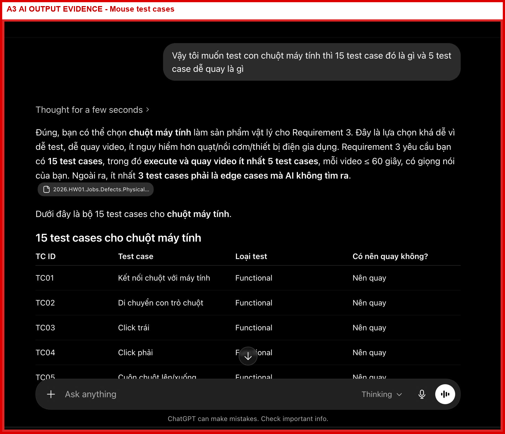

Các edge case sinh viên bổ sung hoặc xác nhận:

#### Ca biên 01: Nhiều bề mặt sử dụng

Test case liên quan:

- TC09 - Kiểm tra trên nhiều bề mặt

Lý do:

- AI có thể giả định chuột luôn dùng trên mouse pad chuẩn.
- Người dùng thực tế có thể dùng chuột trên gỗ, giấy, vải hoặc bề mặt bóng.
- Case này kiểm tra tương thích giữa cảm biến quang và bề mặt thực tế.

#### Ca biên 02: Click liên tục nhanh

Test case liên quan:

- TC10 - Bấm nhiều lần liên tục

Lý do:

- AI thường chỉ tạo test click đơn bình thường, nhưng người dùng thực tế có thể click liên tục khi hệ thống chậm, khi chơi game hoặc khi thao tác lặp.
- Case này kiểm tra độ ổn định input khi thao tác lặp nhanh.

#### Ca biên 03: Rút/cắm lại trong lúc sử dụng

Test case liên quan:

- TC11 - Rút/cắm lại chuột khi đang sử dụng

Lý do:

- Dây USB hoặc receiver có thể bị lỏng/rơi trong điều kiện thực tế.
- Case này kiểm tra hệ thống có phục hồi mà không cần restart hay không.

#### Ca biên 04: Giữ click trái lâu

Test case liên quan:

- TC12 - Giữ click trái trong thời gian dài

Lý do:

- Test click đơn không kiểm tra được trạng thái giữ nút.
- Case này cần cho thao tác drag, chọn vùng và di chuyển file.

#### Ca biên 05: Pin yếu

Test case liên quan:

- TC13 - Kiểm tra chuột khi pin yếu

Lý do:

- Áp dụng cho chuột không dây.
- Giúp phân biệt defect thật của chuột với hiện tượng do pin yếu.

#### Ca biên 06: Khoảng cách kết nối không dây

Test case liên quan:

- TC14 - Kiểm tra khoảng cách kết nối

Lý do:

- Áp dụng cho chuột không dây.
- Kiểm tra độ ổn định kết nối trong điều kiện thực tế, không chỉ khi chuột đặt gần máy.

### 3.7 Kịch bản video TC03 - Click trái

Script:

- Đây là TC03 - Left click.
- Expected result là hệ thống phản hồi đúng khi em click trái vào folder này.
- Em sẽ click trái vào folder.
- Actual result là folder đã được chọn/mở đúng cách.
- Verdict: Pass.

### 3.8 Checklist đáp ứng yêu cầu 3

| Hạng mục yêu cầu | Trạng thái trong report | Ghi chú |
| --- | --- | --- |
| Chọn một thiết bị vật lý cụ thể | Đã làm | Đã chọn chuột máy tính. |
| Nộp 1 ảnh thiết bị + thẻ sinh viên cùng khung hình | Đã có ảnh | Ảnh nằm tại `device_photo_student_id.jpg`. |
| Khai báo brand, model, year, serial number | Chưa hoàn tất | Cần điền thông tin thật của chuột. |
| Thiết kế 15 test cases với Mục tiêu/Đầu vào/Các bước/Kết quả mong đợi/Kết quả thực tế/Kết luận | Đã làm | TC01-TC15 đã có đầy đủ phần tương ứng. |
| Thực thi và quay ít nhất 5 test cases | Đã làm | TC01-TC05 có link YouTube Shorts. |
| Có ít nhất 3 edge cases AI không tìm được | Đã làm | TC09-TC14 có giải thích edge/non-ideal conditions. |
| Screenshot cuộc hội thoại AI cho thấy AI bỏ sót edge cases | Đã có bằng chứng | Ảnh nằm tại `evidence/ai_screenshots/A3_mouse_test_cases_ai_output.png`; sinh viên cần kiểm tra ảnh có đủ prompt/output gốc trước khi nộp. |
| Cố gắng tìm ít nhất 5 defect từ thiết bị | Đã chuẩn bị template | D01-D05 là defect template cho quan sát thật. |

### 3.9 Kết luận yêu cầu 3

Yêu cầu này kiểm thử một chuột máy tính thật bằng 15 test cases, bao gồm chức năng cơ bản, usability, compatibility, wireless-condition, kiểm tra phần cứng và edge cases. Các chức năng lõi gồm kết nối, di chuyển con trỏ, click trái, click phải, cuộn, double click và drag-and-drop. TC01-TC05 đã được thực thi và quay video YouTube Shorts; cả 5 case đã quay đều đạt theo hành vi quan sát được. Các edge case do sinh viên xác nhận tập trung vào điều kiện thực tế như bề mặt khác nhau, click liên tục, rút/cắm lại khi đang dùng, giữ click lâu, pin yếu và khoảng cách kết nối. Điều này cho thấy AI có thể giúp tạo bản nháp test case phổ biến, nhưng tester con người vẫn cần bổ sung tình huống vật lý thực tế và xác minh bằng bằng chứng.

## Phê bình việc sử dụng AI

AI hữu ích trong bài này như một trợ lý tạo bản nháp, đặc biệt khi tổ chức thông tin thị trường việc làm, tóm tắt defect công khai và đề xuất test case ban đầu cho chuột máy tính. Tuy nhiên, output của AI vẫn có nhiều điểm sai, thiên lệch hoặc chưa hoàn chỉnh. Ở phần thị trường việc làm, AI có thể diễn giải quá mức ý nghĩa của job title hoặc xem automation và AI evaluation là cùng một nhóm kỹ năng, trong khi mỗi tin tuyển dụng yêu cầu mức testing, scripting, domain knowledge và communication khác nhau. Ở phần defect, AI có thể bịa nguyên nhân gốc, phóng đại phạm vi ảnh hưởng hoặc biến một sự cố phức tạp thành câu chuyện một nguyên nhân. Ở phần kiểm thử sản phẩm vật lý, AI thường tạo các case sử dụng bình thường như kết nối, di chuyển, click trái, click phải và cuộn, nhưng dễ bỏ sót điều kiện thực tế như nhiều bề mặt, click liên tục, rút/cắm lại khi đang dùng, pin yếu hoặc giới hạn khoảng cách không dây. AI không bắt được các thiếu sót này vì nó dựa trên mẫu phổ biến trong dữ liệu huấn luyện, không trực tiếp quan sát thiết bị, không tự xác minh nguồn và thường ưu tiên câu trả lời mạch lạc hơn bằng chứng. Bài học chính là phải dùng AI như một trợ lý junior: cho cấu trúc và ý tưởng nhanh, nhưng tester con người phải kiểm chứng link, đối chiếu evidence, bổ sung edge cases và chịu trách nhiệm cho kết luận cuối cùng.

## Mandatory Disclosure - Khai báo bắt buộc

Một số phần của report, bao gồm cấu trúc requirement, bản nháp test cases, bảng defect/source link, checklist nộp bài và cách tổ chức nội dung ban đầu, được tạo hoặc hỗ trợ ban đầu bởi OpenAI Codex/ChatGPT. Em đã review và chỉnh sửa các phần tương ứng trong Requirement 1, Requirement 2, Requirement 3 và AI Collaboration Protocol; em bổ sung edge cases TC09, TC10, TC11, TC12, TC13 và TC14; em kiểm tra lại các link nguồn defect; em thay bằng chứng placeholder bằng screenshot việc làm, ảnh thiết bị và link video thật khi có. Phần test execution/video, ảnh thiết bị kèm thẻ sinh viên, screenshot job thật, prompt timestamp thật và các nhận xét/correction cuối cùng được kiểm chứng hoặc thực hiện bởi em. AI Audit Report chi tiết được đính kèm trong `AI_02_Audit_Report.md`. Em xác nhận không dùng AI để tạo bất kỳ artifact nào thuộc nhóm bị cấm, bao gồm ảnh thiết bị với thẻ sinh viên, video thực thi bằng giọng nói/thiết bị thật, screenshot job có tài khoản của em hoặc timestamp prompt log thật.

## Anti-AI-Cheat Mechanisms - Các bằng chứng không được AI tạo

| Artifact bắt buộc không được AI tạo | Bằng chứng trong thư mục | Trạng thái kiểm tra |
| --- | --- | --- |
| Ảnh thiết bị kèm thẻ sinh viên trong cùng khung hình | `device_photo_student_id.jpg` | Đã có ảnh thật trong package; cần bảo đảm thông tin trên thẻ đủ rõ khi nộp. |
| Video thực thi có giọng nói của sinh viên | `Requirement3_Mouse_Video_Links.txt` và các link TC01-TC05 trong Requirement 3 | Đã có 5 link YouTube Shorts; sinh viên cần mở lại từng video để xác nhận âm thanh/giọng nói của mình nghe rõ và video không quá 60 giây. |
| 10 screenshot job phải thể hiện trạng thái đăng nhập / username | `evidence/job_screenshots/job_01...job_10` | Đã có đủ 10 screenshot. Tuy nhiên nhiều ảnh chỉ thấy avatar/trạng thái đăng nhập; nếu TA yêu cầu username bằng chữ, nên chụp lại với menu profile/account đang mở. |
| Prompt log `.md` có timestamp cho mỗi prompt AI | `Appendix_A_Prompt_Log.md` | Đã có Prompt 01-15 với timestamp, tool và prompt text. |

Bằng chứng GitHub Issues có username:

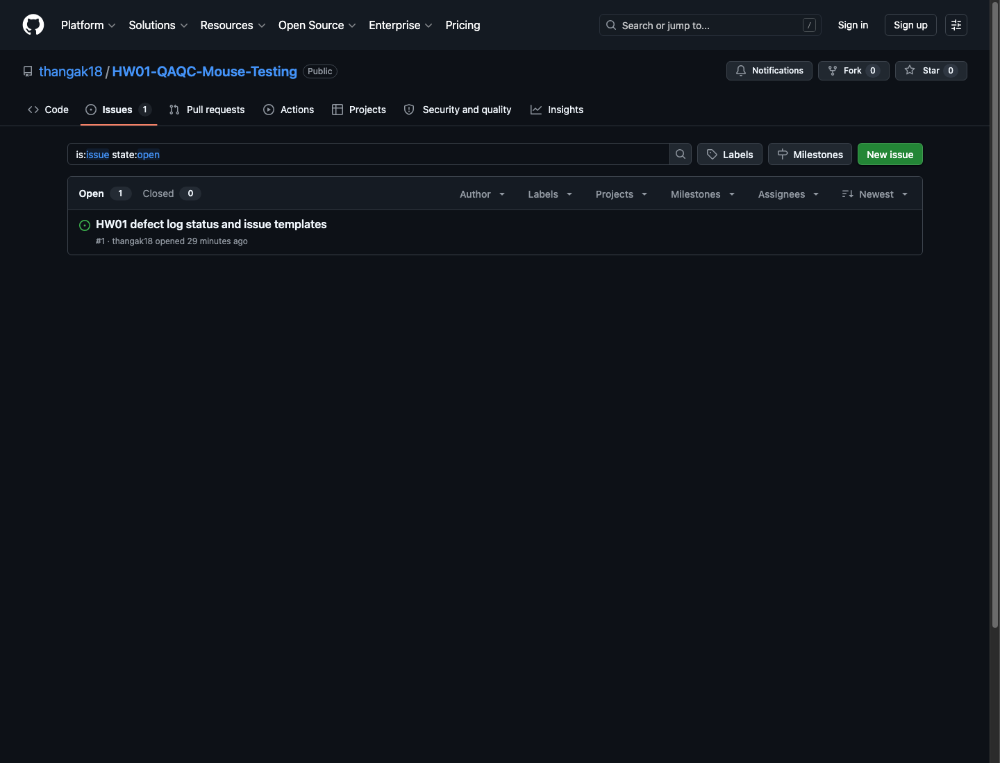

## Tóm tắt AI Audit Report

| Artifact | Prompt/công cụ | Kết luận | Phần sinh viên đã sửa |
| --- | --- | --- | --- |
| A1 Phân tích thị trường việc làm | OpenAI Codex/ChatGPT; xem prompt log | Chưa hoàn chỉnh nếu thiếu screenshot thật | Đã thêm ảnh việc làm và phân tích tác động AI |
| A2 Phân tích defect | OpenAI Codex/ChatGPT; xem prompt log | Hợp lệ sau khi kiểm tra link nguồn, nhưng vẫn cần review | Đã thêm map S1-S20 và ghi chú AI hallucination cho từng defect |
| A3 Test case chuột máy tính | OpenAI Codex/ChatGPT; xem prompt log | Chưa hoàn chỉnh nếu thiếu bằng chứng thực thi thật | Đã thêm edge cases, actual result và link video TC01-TC05 |
| A4 Mindmap critique | OpenAI Codex/ChatGPT; xem prompt log | Hợp lệ | Đã sửa 3 lỗi AI theo ISTQB/QA-QC |

Tỉ lệ chính xác AI tạm tính: Hợp lệ 50%, chưa hoàn chỉnh 50%, không hợp lệ 0%. Tỉ lệ cuối cùng nên cập nhật lại sau khi đối chiếu screenshot output AI với phần sửa thật của sinh viên.

## Tự đánh giá

| No. | Criteria | Grade | Self-Assessed Grade |
| --- | --- | --- | --- |
| 1 | Job Market 2026+ (10 jobs x 3 pts + AI Impact) | 40 | 40 |
| 2 | Software Defects 2022-2026 (20 defects) | 20 | 20 |
| 3 | Physical-product test design (15 TCs + 5 videos) | 25 | 25 |
| AI-1 | [AI-02] AI Audit Report (5-section) attached | 8 | 8 |
| AI-2 | AI Critique 200-300 words + [AI-03] Disclosure attached | 4 | 4 |
| AI-3 | [AI-05] Checklist signed + anti-cheat artifacts | 3 | 3 |
| Total |  | 100 | 100 |
