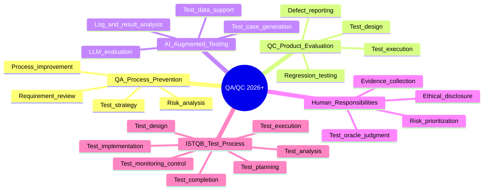

# QA/QC Role and ISTQB Process Mindmap

## Three AI mistakes found and corrected

1. The AI treated QA and QC as the same activity. Correction: QA focuses on process and defect prevention; QC focuses on product evaluation and defect detection.
2. The AI placed test execution before test analysis/design. Correction: ISTQB separates analysis, design, implementation, execution, and completion, with monitoring/control throughout.
3. The AI implied AI tools can fully replace tester judgment. Correction: AI can assist drafting and automation, but human testers own risk decisions, evidence, oracles, safety, and disclosure.
