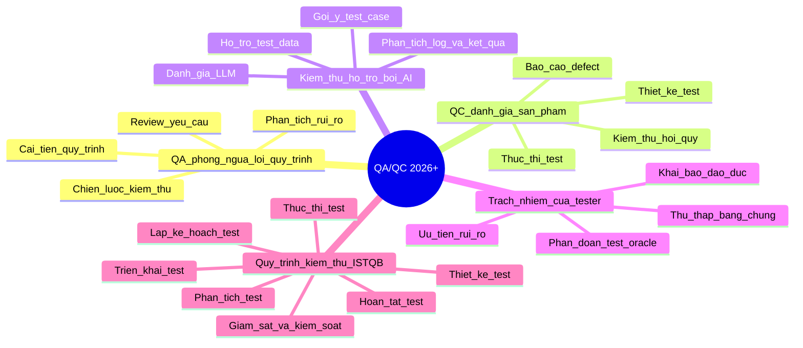

# Mindmap vai trò QA/QC và quy trình ISTQB

## Ba lỗi AI đã phát hiện và chỉnh sửa

1. AI xem QA và QC là cùng một hoạt động. Chỉnh sửa: QA tập trung vào quy trình và phòng ngừa lỗi, còn QC tập trung vào đánh giá sản phẩm và phát hiện defect.
2. AI đặt test execution trước test analysis/test design. Chỉnh sửa: Theo ISTQB, quy trình kiểm thử tách rõ phân tích, thiết kế, triển khai, thực thi và hoàn tất; monitoring/control diễn ra xuyên suốt.
3. AI ngụ ý công cụ AI có thể thay thế hoàn toàn phán đoán của tester. Chỉnh sửa: AI chỉ hỗ trợ tạo bản nháp và automation; tester con người vẫn chịu trách nhiệm về quyết định rủi ro, bằng chứng, test oracle, an toàn và khai báo sử dụng AI.
