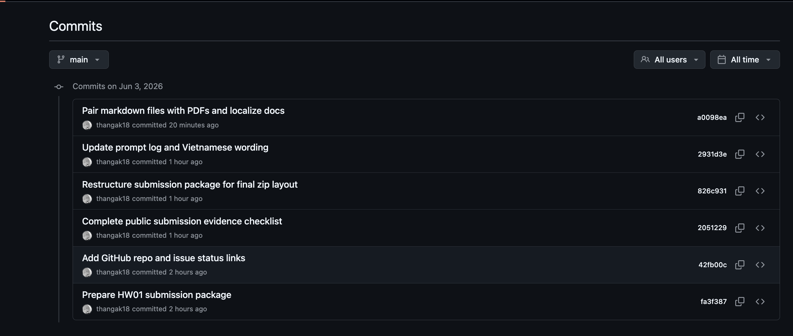

# Nhật ký commit Git - HW01

Kho GitHub: https://github.com/thangak18/HW01-QAQC-Mouse-Testing

Lịch sử commit trực tuyến: https://github.com/thangak18/HW01-QAQC-Mouse-Testing/commits/main

Ngày tạo: 03/06/2026

## Ảnh chụp lịch sử commit cục bộ

File ảnh chụp lịch sử commit: `git_commit_history_screenshot.png`



```text
a0098ea (HEAD -> main, origin/main) Pair markdown files with PDFs and localize docs
2931d3e Update prompt log and Vietnamese wording
826c931 Restructure submission package for final zip layout
2051229 Complete public submission evidence checklist
42fb00c Add GitHub repo and issue status links
fa3f387 Prepare HW01 submission package
```

Cập nhật mới nhất trong ảnh chụp: commit `a0098ea` đã đồng bộ mỗi file Markdown với một file PDF cùng tên, tạo lại Markdown cho AI-03/AI-05 và Việt hóa các file còn thiên tiếng Anh. Các commit mới hơn, nếu có, có thể xem trực tiếp ở link lịch sử commit phía trên.

## Ghi chú

- Repository đang để public để giảng viên/TA có thể kiểm tra bài nộp.
- Bộ hồ sơ có file báo cáo Markdown, báo cáo PDF, AI Audit, prompt log, ảnh bằng chứng, link video và bảng tự chấm điểm.
- Các commit mới hơn ảnh chụp này có thể kiểm tra trực tiếp trên trang lịch sử commit GitHub ở trên.
