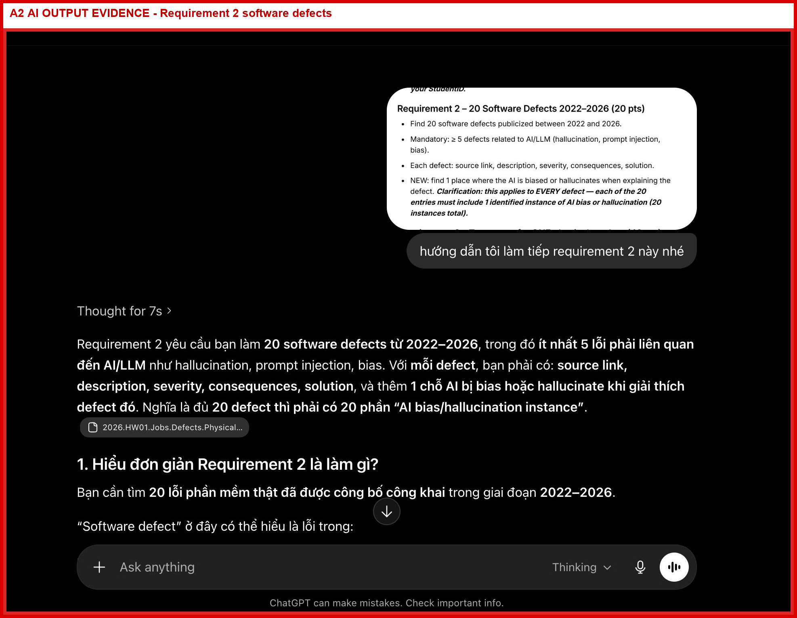
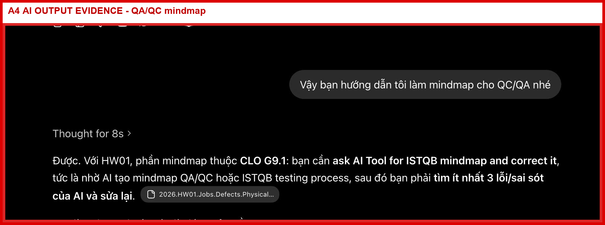

# AI-02 - AI Audit Report

Phụ lục cho HW01 - QA/QC Jobs, Software Defects, and Physical Product Testing.

| Trường thông tin | Giá trị |
| --- | --- |
| MSSV | 23127259 |
| Họ và tên | Nguyễn Tấn Thắng |
| Lớp | 23KTPM4 |
| Ngày lập | 03/06/2026 |

| Artifact | File screenshot AI output đã có |
| --- | --- |
| A1 | `evidence/ai_screenshots/A1_requirement1_jobs_ai_output.png` |
| A2 | `evidence/ai_screenshots/A2_requirement2_defects_ai_output.png` |
| A3 | `evidence/ai_screenshots/A3_mouse_test_cases_ai_output.png` |
| A4 | `evidence/ai_screenshots/A4_mindmap_ai_output.png` |
| A5 | `evidence/ai_screenshots/A5_submission_checklist_ai_output.png` |

## A1 - Requirement 1: QA/QC Job Market 2026+

| Mục | Nội dung |
| --- | --- |
| (1) Prompt + tool | Tool: ChatGPT / OpenAI Codex. Timestamp: 15:45 01/06/2026. Full prompt được ghi trong `Appendix_A_Prompt_Log.md`, Prompt 04. Prompt summary: yêu cầu AI trình bày 10 job theo format thống nhất gồm title, platform, company, link, posted date, screenshot note, summary, skills, salary và AI impact. |
| (2) AI output | Full AI output được cung cấp bằng screenshot thật tại `evidence/ai_screenshots/A1_requirement1_jobs_ai_output.png`. Screenshot hiển thị prompt gốc và phản hồi AI cho phần 10 job; viền đỏ được thêm để đánh dấu đây là evidence AI output. Trước khi nộp cuối, sinh viên cần kiểm tra ảnh có đủ phần output cần audit; nếu chưa đủ thì chụp bổ sung hoặc dán full output. |
| (3) Verdict | INCOMPLETE cho đến khi kiểm tra từng screenshot có ngày đăng, tài khoản và thông tin job rõ ràng. |
| (4) Reasoning | AI có thể format nội dung job, nhưng không thể tự chứng minh screenshot là thật, có đúng ngày hoặc lấy từ tài khoản sinh viên. Evidence QA phải trace được về screenshot thật. |
| (5) Student fix | Đã thêm các file screenshot thật vào `evidence/job_screenshots`, giữ link nguồn. |

Screenshot AI output:

## A2 - Requirement 2: 20 Software Defects 2022-2026

| Mục | Nội dung |
| --- | --- |
| (1) Prompt + tool | Tool: ChatGPT / OpenAI Codex. Timestamp: 15:55 02/06/2026 và 16:00 02/06/2026. Full prompt được ghi trong `Appendix_A_Prompt_Log.md`, Prompt 06 và Prompt 07. Prompt summary: yêu cầu AI tạo và định dạng 20 software defects giai đoạn 2022-2026, có source link, description, severity, consequences, solution và AI bias/hallucination instance. |
| (2) AI output | Full AI output được cung cấp bằng screenshot thật tại `evidence/ai_screenshots/A2_requirement2_defects_ai_output.png`. Screenshot hiển thị prompt gốc và phản hồi AI cho danh sách/phân tích 20 defect; viền đỏ được thêm để đánh dấu evidence AI output. Trước khi nộp cuối, sinh viên cần kiểm tra ảnh có đủ phần output cần audit; nếu chưa đủ thì chụp bổ sung hoặc dán full output. |
| (3) Verdict | VALID AFTER SOURCE REVIEW, nhưng từng defect sẽ là INCOMPLETE nếu link hỏng hoặc source không chứng minh được claim trong report. |
| (4) Reasoning | Phân tích defect công khai cần nguồn đáng tin cậy. AI có thể hallucinate root cause, phóng đại impact hoặc trộn thông tin giữa các sự cố khác nhau. |
| (5) Student fix | Sinh viên đã kiểm tra và sửa link nguồn S1-S20, thay các link hỏng như S1/S4/S6, và thêm một cảnh báo AI bias/hallucination cho từng defect. |

Screenshot AI output:

## A3 - Requirement 3: Computer Mouse Test Cases

| Mục | Nội dung |
| --- | --- |
| (1) Prompt + tool | Tool: ChatGPT / OpenAI Codex. Timestamp: 17:30 02/06/2026. Full prompt được ghi trong `Appendix_A_Prompt_Log.md`, Prompt 11. Full prompt: “Generate 15 test cases for testing a computer mouse. Include objective, input, steps, expected result, actual result, and verdict.” |
| (2) AI output | Full AI output được cung cấp bằng screenshot thật tại `evidence/ai_screenshots/A3_mouse_test_cases_ai_output.png`. Screenshot hiển thị prompt gốc và phản hồi AI cho 15 test cases chuột; viền đỏ được thêm để đánh dấu evidence AI output. Các edge cases sinh viên bổ sung gồm nhiều bề mặt, click liên tục nhanh, rút/cắm lại khi đang dùng, giữ click lâu, pin yếu và khoảng cách kết nối không dây. Trước khi nộp cuối, sinh viên cần kiểm tra ảnh có đủ phần output cần audit; nếu chưa đủ thì chụp bổ sung hoặc dán full output. |
| (3) Verdict | VALID WITH REVIEW. Screenshot output AI gốc đã được thêm; sinh viên vẫn cần kiểm tra ảnh có đủ phần prompt/output cần audit. Test design đã được chỉnh, actual result đã điền cho TC01-TC05 và video evidence đã được thêm. |
| (4) Reasoning | Test case theo ISTQB cần objective, input/precondition, steps, expected result, actual result, verdict và evidence. AI tạo được case chức năng phổ biến, nhưng sinh viên phải tự thực thi test thật và bổ sung edge cases dựa trên hành vi thiết bị vật lý. |
| (5) Student fix | Đã điền actual result cho TC01-TC05, thêm link YouTube Shorts, và bổ sung edge cases như nhiều bề mặt, click liên tục, rút/cắm lại, giữ click lâu, pin yếu và khoảng cách không dây. |

Screenshot AI output:

## A4 - CLO G9.1: QA/QC Role or ISTQB Mindmap

| Mục | Nội dung |
| --- | --- |
| (1) Prompt + tool | Tool: ChatGPT / OpenAI Codex. Timestamp: 17:55 02/06/2026 và 19:00 02/06/2026. Full prompt được ghi trong `Appendix_A_Prompt_Log.md`, Prompt 12 và Prompt 13. Prompt summary: yêu cầu AI tạo mindmap QA/QC role hoặc ISTQB process, sau đó review và chỉ ra ít nhất 3 lỗi/sai sót. |
| (2) AI output | Full AI output được cung cấp bằng screenshot thật tại `evidence/ai_screenshots/A4_mindmap_ai_output.png`. Screenshot hiển thị prompt gốc và phản hồi AI cho mindmap; viền đỏ được thêm để đánh dấu evidence AI output. Các điểm sinh viên đã sửa gồm QA vs QC, thứ tự ISTQB process và giới hạn vai trò AI. Trước khi nộp cuối, sinh viên cần kiểm tra ảnh có đủ phần output cần audit; nếu chưa đủ thì chụp bổ sung hoặc dán full output. |
| (3) Verdict | VALID sau khi sinh viên chỉnh sửa. |
| (4) Reasoning | Artifact hợp lệ vì sinh viên đã chỉ ra và chỉnh các vấn đề khái niệm: QA/QC không giống nhau hoàn toàn, thứ tự ISTQB process được sửa lại, và AI không được xem là thay thế phán đoán của tester. |
| (5) Student fix | Ghi lại 3 lỗi AI đã chỉnh trong main report và giữ artifact mindmap đã sửa trong `QA_QC_Role_Mindmap.md`. |

Screenshot AI output:

## A5 - Submission Checklist / Report Organization

| Mục | Nội dung |
| --- | --- |
| (1) Prompt + tool | Tool: ChatGPT / OpenAI Codex. Timestamp: 19:05 02/06/2026 và 19:10 02/06/2026. Full prompt được ghi trong `Appendix_A_Prompt_Log.md`, Prompt 14 và Prompt 15. Prompt summary: yêu cầu AI tạo checklist nộp bài và viết lại prompt log theo trình tự làm HW01. |
| (2) AI output | Full AI output được cung cấp bằng screenshot thật tại `evidence/ai_screenshots/A5_submission_checklist_ai_output.png`. Screenshot hiển thị prompt gốc và phản hồi AI cho checklist/prompt log; viền đỏ được thêm để đánh dấu evidence AI output. Các mục vẫn cần kiểm tra bằng evidence thật gồm timestamp, video, screenshot và GitHub Issues. Trước khi nộp cuối, sinh viên cần kiểm tra ảnh có đủ phần output cần audit; nếu chưa đủ thì chụp bổ sung hoặc dán full output. |
| (3) Verdict | INCOMPLETE cho đến khi sinh viên xác nhận từng checkbox và timestamp là thật. |
| (4) Reasoning | Checklist có thể do AI hỗ trợ tạo, nhưng trạng thái compliance cuối cùng phụ thuộc vào file thật, evidence thật và timestamp chính xác. Prompt log không được dùng timestamp bịa như bằng chứng cuối cùng. |
| (5) Student fix | Review từng checklist item, thay placeholder timestamp/link còn thiếu và bảo đảm package cuối cùng chỉ chứa evidence thật. |

Screenshot AI output:

## Accuracy Ratio and Conclusion

| Verdict type | Tỉ lệ | Giải thích |
| --- | --- | --- |
| VALID | 2/5 artifacts = 40% | A2 sau khi review nguồn; A4 sau khi sinh viên chỉnh. Screenshot AI output A1-A5 đã được thêm vào package. |
| INCOMPLETE | 3/5 artifacts = 60% | A1 cần kiểm tra screenshot job cuối; A3 cần đảm bảo screenshot AI output đủ phần phản hồi gốc; A5 cần xác nhận timestamp/checklist. |
| INVALID | 0/5 artifacts = 0% | Không artifact nào được cố tình nộp ở trạng thái invalid; output yếu đã được chỉnh hoặc đánh dấu incomplete |

Kết luận: AI nên được dùng để brainstorming, tạo cấu trúc report, tạo bản nháp và gợi ý test ideas. AI không nên dùng làm evidence cuối cùng, test oracle cuối cùng, công cụ xác minh nguồn, bằng chứng thực thi thiết bị thật hoặc thay thế phán đoán của sinh viên/tester. Trách nhiệm QA/QC cuối cùng vẫn thuộc về sinh viên.

Xác nhận của sinh viên: Em đã review nội dung AI tạo ra, chỉnh các phần thiếu căn cứ hoặc chưa hoàn chỉnh, và sẽ chỉ nộp screenshot thật, video evidence thật và link nguồn đã kiểm tra trong bản nộp cuối.
